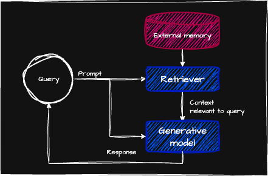

# RAG and Agents

To solve a task, model needs:
- Instructions on how to do it
  - Common to all queries
- Necessary information to do
  - Context is specific to each query

Context construction patterns:
- **Retrieval-augmented-generation (RAG)**
  - Retrieve relevant information from external source
- **Agents**
  - Use tools (web search, news API) to gather information

## RAG

RAG improves a model's generation by retrieving the relevant information from external sources.
External sources can be:
- internal database
- previous chat session
- internet

RAG can be used as a solution for knowledge-intensive tasks.
- retriever: only the information most relevant to the query is retrieved then input to the model.
Construct context specific to each query.

Context construction:
- feature engineering in ML
- giving the necessary information to process as input
- used to overcome the models' context limitation

Regardless of models context capacity, RAG is still important.
- longer context doesn't mean better use of context
- longer the context, likely to focus on the wrong part of context

RAG can:
- reduce the number of input tokens
- increase the model performance

### RAG Architecture

RAG system has two components:
- **retriever**: retrieves information from external source
- **generator**: generates a response based on the retrieved information

Two components are often trained separately, but finetuning the whole RAG system end-to-end can improve the performance significantly.

Quality of retriever defines the success of RAG.
The retriever has two functions:
- **Indexing**: processing data to retrieve data later
- **Query**: retrieve data relevant to it.

**Chunking strategy**: To avoid arbitrary context size, split each document into more manageable chunks.
Goal is to retrieve the data chunk most relevant to the query.

### Retrieval Algorithm

Traditional retrieval systems can be used for RAG. The retrieval works by ranking documents based on relevance to a given query.

#### Term-based Retrieval

- lexical retrieval
  - keyword based
  - problem 1: insufficient context space to include all
    - term frequency(TF): more term appears, the more relevant
  - problem 2: some term is more important than the other
    - inverse document frequency(IDF): term's importance is inversely proportional to the number of documents it appears in (e.g. at, for). 
    - IDF = nTotalDocument / nDocumentWithTerms
    - Higher IDF = more important
  - TF-IDF: combines TF and IDF.
- Two common solutions
  - Elasticsearch
  - BM25
- Tokenisation: process of breaking a query into individual terms
  - split the query into words
    - lose meaning (i.e. hot dog vs hot, dog)
    - most common n-grams to avoid issue
  - convert all characters to lowercase
  - remove punctuation
  - eliminate stop words (i.e. the, and, is)
  - n-gram overlap between query and document
    - works best when lengths of both are similar
    - difficult to distinguish when documents are much longer

#### Embedding-based Retrieval

- how closely meaning of document align with the query
- indexing: converting the original data chunk into embeddings
  - vector database: database generated by embedding
- querying steps:
  1. Embedding model: convert the query into an embedding
  2. Retriever: fetch k data chunks whose embeddings are closest to the query embedding
- reranker: rerank all retrieved candidates
- cache: reduce latency
- embedding-based retriever doesn't work if the embedding model is bad
- vector database:
  - storing is easy
  - vector search is hard
  - vector has to be indexed and stored in a way to search fast and efficient
- vector search:
  - nearest neighbour search problem
  - K-nearest neighbours (KNN)
    1. compute similarity scores between query embedding and all vectors using cosine similarity
    2. rank all vectors by similarity scores
    3. return k vectors with highest similarity scores
    - precise result, but computationally heavy and slow. Should only be used for small datasets.
  - approximate nearest neighbour (ANN)
    - for large dataset
    - vector database organise vectors into bucket, trees or graphs
    - quantized and sparse vectors are less computationally intensive
    - LSH (Locally Sensitive Hashing)
      - hashing to speed up similarity search
    - HNSW (hierarchical Navigable Small World)
      - Multi-layer graph where nodes represent vectors. Nearest neighbour search by traversing graph edges
    - Product Quantization
      - lower dimensional representation by decomposing each vector into multiple subvectors. Faster to work
    - IVF (Inverted file index)
      - Organise similar vectors into the same cluster
    - Annoy (Approximate Nearest Neighbors Oh Yeah)
      - Multiple binary trees

#### Comparing Retrieval Algorithms

- Term-based retrieval
  - faster during both indexing and query
  - less computationally expensive
  - works well out of the box
- Embedding based retrieval
  - Can be significantly improved over time
  - finetune the embedding model and retriever
  - can obscure keywords

Metrics used by RAG evaluation frameworks
- context precision
  - Out of all documents retrieved, what percentage is relevant to the query?
  - Some RAG only support context precision as it's simpler to compute
- context recall
  - Out of all documents that are relevant to the query, what percentage is retrieved?

Semantic retrieval, should evaluate the quality of embeddings.
Data changes frequently -> frequent embedding regeneration.
More detailed the index, more accurate the retrieval, but slower.

ANN benchmarks four main metrics
- Recall: the fraction of nearest neighbours found by the algorithm
- Query per second (QPS): The number of queries that can be handled per second
- Build time: time required to build the index
- Index size: The size of index

Quality of a RAG should be evaluated both component by component and end to end.
1. Evaluate the retrieval quality
2. Evaluate the final RAG output
3. Evaluate the embeddings

#### Combining Retrieval Algorithms

Reranking:
- Hybrid search: combining term-based and embedding-based retrieval.
  1. Cheap, less precise retriever term-based system fetches candidates
  2. More precise and more expensive embedding based retrieval finds the best of candidates

### Retrieval Optimisation

Improve retrieval result:
1. chunking strategy
2. reranking
3. query rewriting
4. contextual retrieval

#### Chunking Strategy

- Split documents into smaller, more manageable chunks before indexing
- Trade-off between chunk size and retrieval granularity:
  - Smaller chunks: more precise retrieval, but may lose surrounding context
  - Larger chunks: more context preserved, but may include irrelevant information
- Common approaches:
  - Fixed-size chunking (e.g. 512 tokens)
  - Sentence-based or paragraph-based splitting
  - Recursive splitting (split by hierarchy: document → section → paragraph → sentence)
  - Semantic chunking (split based on topic or meaning boundaries)
- Overlap between chunks can help preserve context at boundaries

#### Reranking

- Two-stage retrieval pipeline:
  1. Initial retrieval: cheap, less precise retriever fetches a broad set of candidates (e.g. ~50 documents)
  2. Reranking: more precise, more expensive model scores and reorders the candidates
- Rerankers can be:
  - Cross-encoder models (jointly encode query and document for more accurate relevance scoring)
  - LLM-based rerankers
- Reranking improves precision without needing to run the expensive model over the entire corpus

#### Query Rewriting

- Rewrite the query to reflect what the user is actually asking
- The new query should make sense on its own, without needing prior conversation context
- Useful when queries are ambiguous or reference prior conversation
  - e.g. "How about her?" → "How about Aunt Mabel from the previous question?"
- Prompt pattern: *"Given the following conversation, rewrite the last user input to reflect what the user is actually asking"*
- The rewriting model should acknowledge when a query isn't solvable rather than hallucinating, which would lead to retrieving wrong answers
- Trade-off: adds latency due to the additional generation step

#### Contextual Retrieval

- "Chunks-for-chunks" approach: retrieve supplementary context for initially retrieved chunks
- After fetching initial chunks, retrieve additional metadata, tags, or related chunks to enrich context
- Helps the generator understand the broader context around a specific chunk
- Can include:
  - Document-level metadata (title, author, date)
  - Section headers or summaries
  - Neighbouring chunks from the same document

#### Evaluating Retrieval Solution

- Evaluate both component-by-component and end-to-end
- Key metrics:
  - Context precision: of all documents retrieved, what percentage is relevant?
  - Context recall: of all relevant documents, what percentage was retrieved?
- Cost considerations:
  - According to the reference, vector database expenses can consume between one-fifth to one-half of total model API spending
  - Includes both storage and query costs
- Monitor:
  - Retrieval latency
  - Index build time and size
  - Embedding regeneration frequency (important when data changes often)

### RAG beyond Text

#### Multimodal RAG

- Extend RAG beyond text to include images, audio, and video
- Approaches:
  - Convert non-text modalities to text (e.g. image captioning, speech-to-text) then use standard text RAG
  - Use multimodal embedding models that embed different modalities into a shared vector space
  - Use multimodal LLMs that can directly process mixed-modality retrieved content
- Challenges:
  - Aligning embeddings across modalities
  - Evaluating retrieval quality for non-text data

#### RAG with Tabular Data

- Structured data (tables, databases) requires different retrieval strategies than unstructured text
- Approaches:
  - Text-to-SQL: convert natural language query into SQL to retrieve from databases
  - Table serialisation: convert tables to text format for embedding and retrieval
  - Hybrid: combine structured queries with semantic search over table descriptions
- Challenges:
  - Preserving table structure and relationships
  - Handling large tables that exceed context limits

## Agents

### Overview

- An agent is "an entity capable of perceiving its environment and acting upon it"
- Characterised by:
  - The environment it operates in
  - The actions/tools available to it
- Agents use tools to gather information and take actions to accomplish tasks
- RAG can be viewed as a specialised agent pattern where the retriever functions as a tool

### Tools

Tools extend what an agent can do beyond the base model's capabilities. Three categories:

#### Knowledge Augmentation

- RAG systems: retrieve information from internal databases or document stores
- Web search: access up-to-date information from the internet
- API calls: query external services for specific data (e.g. weather, stock prices, news)
- These tools provide the agent with information it doesn't have in its training data

#### Capability Extension

- Code interpreters: execute code to perform calculations, data analysis, or generate visualisations
- Terminal access: run shell commands, interact with the file system
- Function execution: invoke external functions or services
- According to the reference, capability extension tools significantly boost performance compared to prompting or fine-tuning alone

#### Write Actions

- Data manipulation: create, update, or delete records in databases
- Storage operations: save files, update documents
- External interactions: send emails, post messages, create calendar events
- These are the most impactful but also the riskiest tools — they change state in the real world

### Planning

#### Foundation Models as Planners

- There is debate about whether autoregressive models can truly plan
- In practice, foundation models can decompose tasks and generate step-by-step plans
- Planning quality depends heavily on the model's capabilities and the prompt design

#### Plan Generation

_Decoupling planning and execution to execute only validated plans_

- Four-stage planning cycle:
  1. **Plan generation**: decompose the task into sub-tasks
  2. **Initial reflection**: evaluate the plan before execution
  3. **Execution**: carry out the plan via function calls and tool use
  4. **Final reflection**: evaluate the outcome and adjust if needed
- Ways to improve plan generation:
  - Enhance system prompts with examples
  - Provide better tool descriptions and documentation
  - Refactor complex functions into simpler ones
  - Use stronger models or fine-tune for planning

#### Function Calling

- The mechanism by which agents invoke tools
- Requires:
  - Tool inventory: function names, parameters, and documentation
  - Usage specifications: which parameters are required vs optional
- The model generates structured output (e.g. JSON) specifying which function to call and with what arguments

#### Planning Granularity

- Trade-off: "Higher-level plans are easier to generate but harder to execute, while detailed plans are harder to generate but easier to execute"
- Generate higher level plan, then move to finer level plan.
- Tool inventory can change over time
  - Using exact function names makes it harder to reuse a planner across different use cases with different tool APIs (fine-tuning required)
  - To avoid this problem, plans can be generated using more natural language
  - This approach requires an additional "translator" to translate each natural language action into an executable command, however it's a simpler task than planning and lower risk of hallucination

#### Complex Plans

- Execution patterns for multi-step plans:
  - **Sequential**: actions performed one after another; predictable but potentially slow
  - **Parallel**: concurrent actions when there are no dependencies; faster but adds complexity
  - **Conditional**: decision points (if-statements) that adapt based on intermediate results
  - **Iterative**: loops for repetitive tasks over datasets or collections

#### Reflection and Error Correction

- Agents should evaluate their own outputs and actions
- When an action fails or produces unexpected results:
  - Reflect on what went wrong
  - Adjust the plan or try alternative approaches
  - Avoid repeating the same failed action
- Self-reflection can be built into the agent loop as an explicit step

#### Tool Selection

- More tools give more capabilities; however, the more tools there are, the harder it is to efficiently use them
- Systematic approach to choosing and evaluating tools:
  - Conduct ablation studies to measure each tool's impact on performance
  - Monitor usage patterns and error rates
  - Analyse call distribution across tools
- Model-specific preferences: different models may prefer different tool sets
  - According to the reference, GPT-4 tends to use broader tool sets than ChatGPT

### Agent Failure Modes and Evaluation

#### Planning Failures

- Most common mode of planning failure is tool use failure.
  - **Invalid tool**: model selects a tool that does not exist or is not available
  - **Valid tool, invalid parameters**: model calls the right tool but with parameters that do not match the expected schema
  - **Valid tool, incorrect parameter values**: model calls the right tool with valid parameter names, but the values are wrong or nonsensical
- Mitigation: clear tool documentation, constrained tool selection, schema validation, few-shot examples

#### Tool Failures

- The tool itself executes but produces wrong or unusable outputs:
  - External service downtime or rate limiting
  - Stale or incorrect data returned by the tool
  - Misunderstanding of tool capabilities leading to misinterpreted results
- Mitigation: robust error handling, fallback strategies, output validation, retry logic

#### Efficiency

- Evaluation should cover:
  - Average number of steps the agent needs to complete a task
  - Cost per task completion (token usage, API calls, tool invocations)
  - Time taken per action (latency profiling for each step in the pipeline)

### Memory

Memory allow a model to retain and utilise information.

- Three types of memory:
  - **Internal knowledge**: what the model learnt during training (parametric memory)
  - **Short-term memory**: the current conversation context (context window)
  - **Long-term memory**: persistent storage across sessions (external databases, vector stores)
- Memory is essential for:
  - Managing information overflow within limited context windows
  - Maintaining consistency across interactions
  - Persisting user preferences and prior decisions
  - Preserving structural integrity of complex data

## Summary

- RAG and agents are both **prompt-based methods** — they influence the model's quality solely through inputs without modifying the model itself
- **RAG** was originally developed to overcome a model's context limitations, but also enables more efficient use of information, improving response quality while reducing costs
  - Two-step process: retrieve relevant information from external memory, then generate more accurate responses
  - The success of a RAG system depends on the quality of its retriever
  - Term-based retrievers (Elasticsearch, BM25): lighter to implement, strong baselines
  - Embedding-based retrievers: more computationally intensive, but potential to outperform term-based algorithms
  - Embedding-based retrieval is powered by **vector search**, also the backbone of core internet applications (search, recommender systems)
  - Optimisation through chunking, reranking, query rewriting, and contextual retrieval
  - Evaluation via context precision and recall
- **RAG is a special case of an agent** where the retriever is a tool the model can use
- **Agents** are defined by their environment and the tools they can access
  - AI is the planner that analyses its given task, considers different solutions, and picks the most promising one
  - Planning can be augmented with **reflection** and a **memory system** to help keep track of progress
  - More tools → more capabilities → more challenging tasks solvable
  - However, **the more automated the agent becomes, the more catastrophic its failures**
  - Tool use exposes agents to many security risks; rigorous defensive mechanisms need to be in place
- Both RAG and agents work with a lot of information, often exceeding the maximum context length → necessitates a **memory system** for managing and using all the information
- While RAG and agents can enable many incredible applications, modifying the underlying model can open up even more possibilities (next chapter: fine-tuning)
