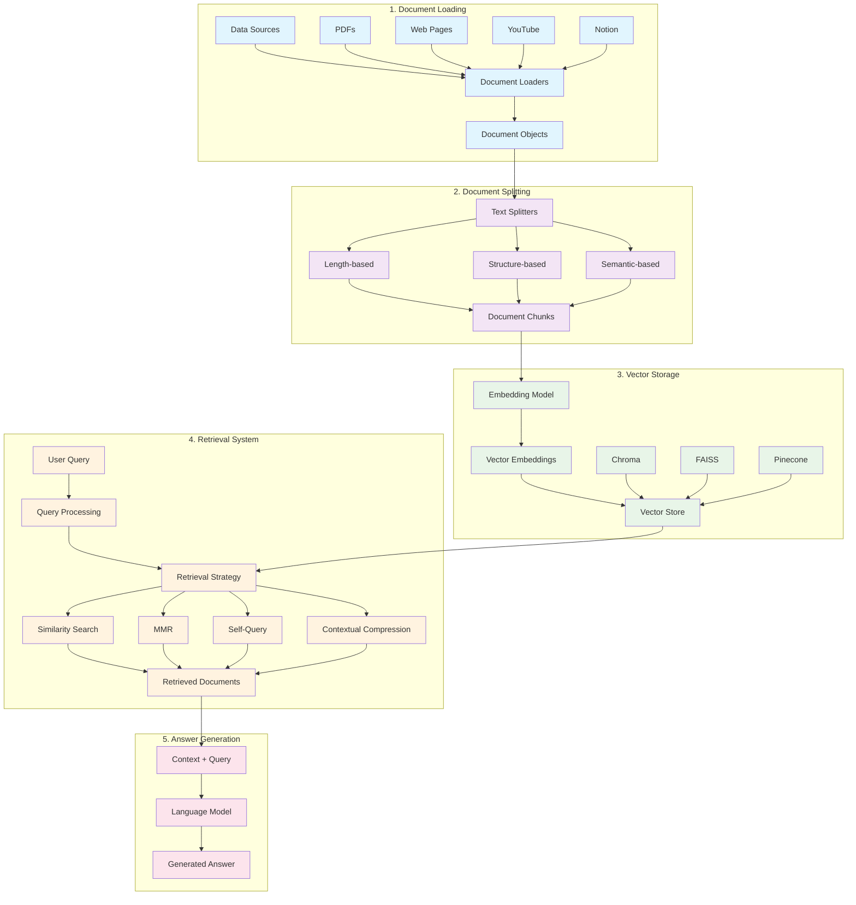

# LangChain RAG (Retrieval-Augmented Generation) Summary

**Table of Contents**
- [Overview](#overview)
- [1. Document Loading](#1-document-loading)
- [2. Document Splitting](#2-document-splitting)
- [3. Vectors and Embeddings](#3-vectors-and-embeddings)
  - [Embeddings](#embeddings)
  - [Vector Stores](#vector-stores)
- [4. Retrieval Strategies](#4-retrieval-strategies)
  - [Basic Similarity Search](#basic-similarity-search)
  - [Maximum Marginal Relevance (MMR)](#maximum-marginal-relevance-mmr)
  - [Self-Query Retrieval](#self-query-retrieval)
  - [Contextual Compression](#contextual-compression)
- [Strategy Selection Guide](#strategy-selection-guide)
- [Combining Strategies](#combining-strategies)
- [Performance Considerations](#performance-considerations)
- [Visual Component Architecture](#visual-component-architecture)
  - [Component Interaction Flow](#component-interaction-flow)
  - [Key Integration Points](#key-integration-points)

## Overview

RAG is a technique that combines information retrieval with language model generation to provide accurate, contextual responses using external knowledge. The process involves:

1. **Vector Store Loading**: Document loading, splitting, and storage
2. **Retrieval**: Query processing and finding relevant content
3. **Generation**: Using retrieved context to generate answers

## 1. Document Loading

**Purpose**

Convert various data sources into LangChain `Document` objects for processing.

**Key LangChain Objects**

- `PyPDFLoader` - PDF documents
- `GenericLoader` + `FileSystemBlobLoader` + `OpenAIWhisperParser` - Audio/Video
- `WebBaseLoader` - Web pages
- `NotionDirectoryLoader` - Notion databases

**Loader Capabilities**

- **Data Sources**: Web sites, databases, YouTube, arXiv
- **Formats**: PDF, HTML, JSON, Word documents
- **Output**: Document objects with content and metadata

**Examples**

```python
# PDF Loading
from langchain.document_loaders import PyPDFLoader
loader = PyPDFLoader("~/Documents/my_doc.pdf")
pages = loader.load()

# Web Loading
from langchain.document_loaders import WebBaseLoader
loader = WebBaseLoader("https://example.com/document")
docs = loader.load()
```

## 2. Document Splitting

**Purpose**

Break down large texts into smaller, manageable chunks to:
- Handle varying document lengths consistently
- Overcome model input size limitations
- Improve text representation quality
- Enhance retrieval precision

**Key LangChain Objects**

- `RecursiveCharacterTextSplitter` - Hierarchical splitting
- `CharacterTextSplitter` - Simple character-based splitting
- `TokenTextSplitter` - Token-based splitting
- `MarkdownHeaderTextSplitter` - Structure-aware splitting

**Splitting Strategies**

1. Length-Based Splitting
   - **Character-based**: Split by character count
   - **Token-based**: Split by token count (useful for LLM input limits)
2. Text Structure-Based Splitting
    - Uses `RecursiveCharacterTextSplitter` with hierarchical separators:
    ```python
    r_splitter = RecursiveCharacterTextSplitter(
        chunk_size=1500,
        chunk_overlap=150,
        separators=["\n\n", "\n", "\. ", " ", ""]
    )
    ```
3. Document Structure-Based Splitting
  - **Markdown**: Split by headers (#, ##, ###)
  - **HTML**: Split by tags
  - **JSON**: Split by objects/arrays
4. Semantic Meaning-Based Splitting
   - Uses embedding similarity to find natural breakpoints in content.

## 3. Vectors and Embeddings

### Embeddings

**Definition**: Vector representations of text that capture semantic meaning.

**Key Properties**:
- Similar texts have similar vectors
- Enable mathematical comparison (cosine similarity, dot product)
- Support semantic search beyond keyword matching

**Key LangChain Objects**

- `OpenAIEmbeddings` - OpenAI embedding models
- `Chroma` - Local vector store
- `FAISS` - Efficient similarity search library

### Vector Stores

**Purpose**: Specialized databases for storing and searching embedding vectors.

**Workflow**:
1. Documents split into chunks
2. Chunks converted to embedding vectors
3. Vectors stored with metadata
4. Queries embedded and compared against stored vectors
5. Most similar chunks retrieved

**Options**:
- **Local**: Chroma, FAISS
- **Cloud**: Pinecone, MongoDB Atlas, Qdrant, PostgreSQL (PGVector)

```python
from langchain.vectorstores import Chroma
vectordb = Chroma.from_documents(
    documents=splits,
    embedding=embedding,
    persist_directory='docs/chroma/'
)
```

## 4. Retrieval Strategies

### Basic Similarity Search
Standard semantic similarity search using vector comparisons.

### Maximum Marginal Relevance (MMR)
**Purpose**: Balance relevance and diversity to avoid redundant results.

**Algorithm**:
1. Query vector store for top `fetch_k` similar documents
2. Iteratively select `k` most diverse documents
3. Consider both query similarity and dissimilarity to selected documents

**Parameters**:
- `k`: Number of documents to return
- `fetch_k`: Documents to consider for diversity selection
- `lambda_mult`: Diversity parameter (0=max diversity, 1=min diversity)

### Self-Query Retrieval
**Purpose**: Parse natural language queries into semantic content + metadata filters.

**Process**:
1. LLM parses user query
2. Extracts semantic part and metadata filters
3. Combines similarity search with metadata filtering

**Example**: "What did they say about regression in the third lecture?"
- Semantic: "regression"
- Filter: `source == "Lecture03.pdf"`

### Contextual Compression

**Purpose**: Extract only relevant segments from retrieved documents.

**Two-Phase Process**:
1. **Retrieval**: Fetch potentially relevant documents (optimize for recall)
2. **Compression**: Extract relevant segments (optimize for precision)

**Available Compressors**:
- `LLMChainExtractor`: Uses LLM to extract relevant segments
- `EmbeddingsFilter`: Filters by embedding similarity (faster)
- `DocumentCompressorPipeline`: Combines multiple techniques

## Strategy Selection Guide

| Strategy | Use When |
|----------|----------|
| **Standard Similarity** | Simple semantic queries, fast response needed |
| **MMR** | Redundant content, need diverse perspectives, large collections |
| **Self-Query** | Queries with metadata references, natural language filtering |
| **Contextual Compression** | Long documents, limited context windows, need precision |

## Combining Strategies
Most effective systems combine multiple techniques:
- **MMR + Compression**: Diverse, relevant segments
- **Self-Query + Compression**: Metadata-filtered, compressed results
- **All Three**: Maximum precision and flexibility

## Performance Considerations
- Modern vector stores handle billions of embeddings
- Sub-50ms query latency possible at scale
- HNSW algorithm commonly used for efficient search
- Balance between accuracy and speed based on requirements

---

## Visual Component Architecture



### Component Interaction Flow

1. **Data Ingestion**: Various data sources → Document loaders → Structured documents
2. **Preprocessing**: Documents → Text splitters → Manageable chunks
3. **Vectorization**: Chunks → Embedding models → Vector representations → Vector store
4. **Query Processing**: User query → Retrieval strategies → Relevant documents
5. **Answer Generation**: Retrieved context + Query → LLM → Final answer

### Key Integration Points

- **Loaders ↔ Splitters**: Document format affects optimal splitting strategy
- **Splitters ↔ Embeddings**: Chunk size impacts embedding quality
- **Vector Store ↔ Retrievers**: Storage format affects retrieval capabilities
- **Retrievers ↔ LLM**: Retrieved context quality directly impacts answer quality

This architecture enables building sophisticated RAG systems that can efficiently process, store, and retrieve information from large document collections while maintaining semantic understanding and contextual relevance.