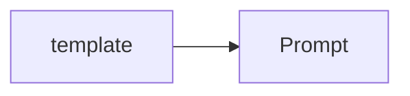
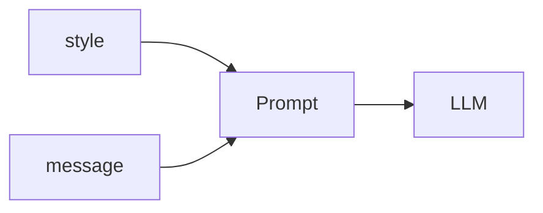
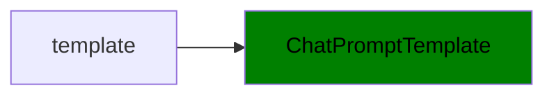
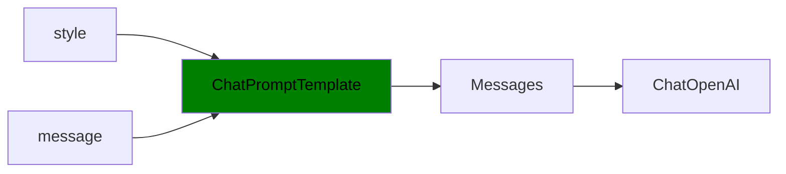
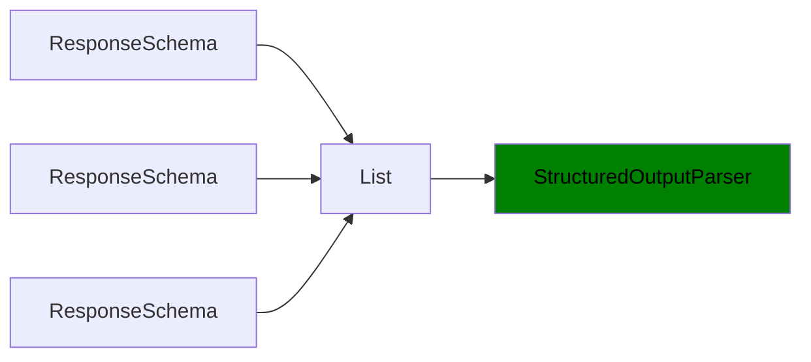
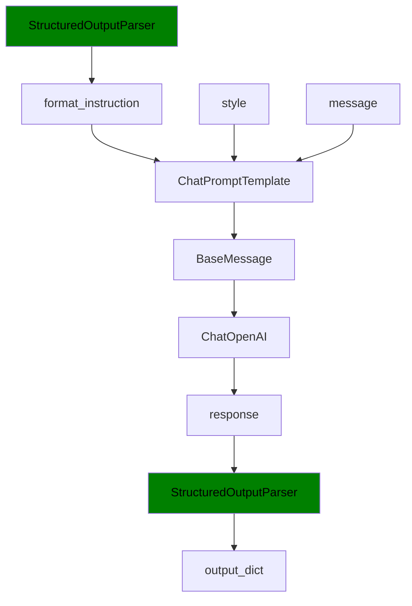
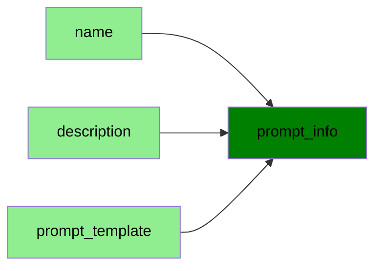
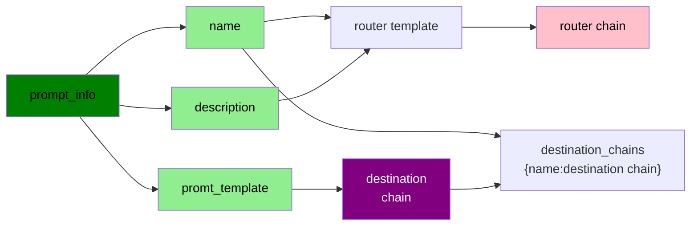
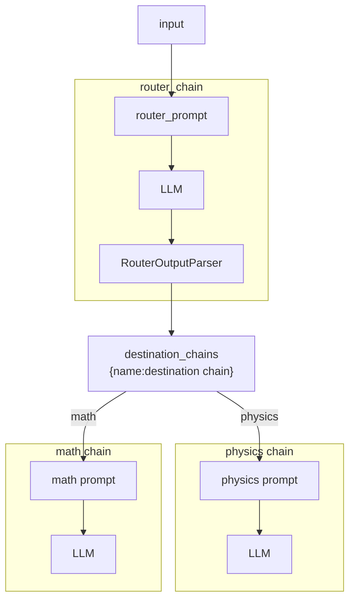

# Model, Prompt and Parser

## Topics

- Models
	- LLMs
	- Chat Models
	- Text Embedding Models
- Prompts
	- Prompt Templates
	- Output Parsers
		- Retry/fixing
	- Example Selectors
- Indexes
	- Document Loaders
	- Text Splitters
	- Vector Stores
	- Retrievers
- Chains
	- Prompt + LLM + Output Parsing
- Agents
	- Algorithms for getting LLMs to use tools

## LangChain Objects

- `langchain.chat_models.ChatOpenAI`
- `langchain.prompts.ChatPromptTemplate`
- `langchain.output_parsers.ResponseSchema`
- `langchain.output_parsers.StructuredOutputParser`

## Model

### OpenAI API

> https://github.com/openai/openai-python

OpenAI provide a pythonAPI to interact with their LLM.

**Setup OpenAI API**


```python
# Setup OpenAI and API key
import openai

def setup_openai_api_key():
    from dotenv import load_dotenv
    _ = load_dotenv()
setup_openai_api_key()

LLM_MODEL:str = "gpt-4o-mini"
# LLM_MODEL:str = "gpt-3.5-turbo"
```

**OpenAI responses API**


```python
def get_openai_response(message:str, instruction:str, model:str=LLM_MODEL):
    response = openai.OpenAI().responses.create(
        model=model,
        instructions=instruction,
        input=message,
    )
    return response.output_text
```

**OpenAI chat completions API**


```python
def get_openai_chat_completion(prompt:str, model=LLM_MODEL):
    completion = openai.OpenAI().chat.completions.create(
        model=model,
        messages=[{
                "role": "user",
                "content": prompt,
        }],
        temperature=0,
    )
    return completion.choices[0].message.content
```

## Prompt

Prompt is a template that structures input to language models. It defines how to format user input, system instructions, and context before sending to the LLM.

Prompts ensure consistent, structured communication between your application and the LLM.

**Key components:**
- `ChatPromptTemplate`:  formats messages for chat models
- `SystemMessagePrompt`: sets AI behavior/role
- `HumanMessagePrompt`: user input template
- `Variables`: placeholders filled at runtime (e.g., {user_input}, {context})


**Create prompt from template:**



**Use prompt to get response:**




```python
customer_email = """\
Arrr, I be fuming that me blender lid \
flew off and splattered me kitchen walls \
with smoothie! And to make matters worse,\
the warranty don't cover the cost of \
cleaning up me kitchen. I need yer help \
right now, matey!\
"""

style = """\
British English \
in a calm and respenctful tone\
"""

prompt = f"""\
Translate the text \
that is delimited by triple backticks \
into a style that is {style}.
text: ```{customer_email}```
"""
```

- `\` at the end of each line of the prompt template:
  - `\` is a line continuation character in Python. It removes `\n` and makes a string into one line.

```python
response = get_openai_chat_completion(prompt=prompt)
print(response)
```

# LangChain 

### ChatOpenAI

The `ChatOpenAI` helps make prompts reproducible in a controlled manner when used with `ChatPromptTemplate`. It can be thought of as a model adapter to use with `ChatPromptTemplate`.
- **Input**: list of messages
- **Output**: a message


```python
from langchain_openai import ChatOpenAI
chat = ChatOpenAI(
    model=LLM_MODEL,
    temperature=0.0)
```

- temperature:
  - Randomness and creativity of generated text can be controlled by temperature.
  - A higher value (e.g., 1.0) makes responses more creative
  - A lower value (e.g., 0.0) makes them more deterministic and focused

### ChatPromptTemplate

> https://python.langchain.com/api_reference/core/prompts/langchain_core.prompts.chat.ChatPromptTemplate.html

Translates user input and parameters into instructions for a model.
`ChatPromptTemplate` will be used to format a list of messages.

- **Input**: `dict`
	- **key**: a variable in the prompt template to fill in
	- **value**: a value replacing a variable in the prompt
- **Output**: `PromptValue`
	- can be passed into `ChatModel`
	- can be cast to a string or list of messages
	- `PromptValue` allows switching between string and message formats

**Prompt template 1:**


```python
from langchain_core.prompts import ChatPromptTemplate

prompt_template = ChatPromptTemplate([
    ("system", "You are a helpful assistant"),
    ("user", "Tell me a joke about {topic}")
])

prompt_template.invoke({"topic": "cats"})
```

**Prompt template 2:**

```python
from langchain.prompts import ChatPromptTemplate

template_string = """\
Translate the text that is delimited by triple backticks \
into a style that is {style}. \
text: ```{text}```
"""
# Make prompt template
prompt_template:ChatPromptTemplate = ChatPromptTemplate.from_template(template_string)

# Create a prompt from template
customer_style = "British English"
customer_email = "Ah, I be fuming that my blender lid flew off!"
customer_messages = prompt_template.format_messages(
	style=customer_style,
	text=customer_email)
type(customer_messages[0]) # <class 'langchain.schema.HumanMessage'>

# Get response from the chat model
chat = ChatOpenAI(model=LLM_MODEL, temperature=0.0)
customer_response = chat(customer_messages)
```

- Access prompt:
  - `prompt_template.messages[0].prompt`
- Access prompt input vars:
  - `prompt_template.messages[0].prompt.input_variables`


### Overview

**Create prompt from template:**



**Use prompt to get response:**



## StructuredOutputParser

It's possible to get JSON-formatted strings from LLM by adding format instructions in the prompt. However, the response is always `str` not `dict`; therefore, additional parsing is needed.

`StructuredOutputParser` parses the `str` response into desired format.

With output parser:
- format instructions can be created
- output responses can be parsed into `dict`

### ResponseSchema

`ResponseSchema` is a building block of `StructuredOutputParser` that defines format instructions and the structure of output `dict`.

Output format of `StructuredOutputParser.get_format_instructions`


```python
"""
The output should be a markdown code snippet formatted in the following schema, including the leading and trailing "```json" and "```":

\```json
{
	"gift": string  // Was the item purchased as a gift for someone else?                              Answer True if yes, False if not or unknown.
	"price_value": string  // Extract any sentences about the value or                                     price, and output them as a comma separated Python list.
}
\```
"""
```

```python
from langchain.output_parsers import ResponseSchema
from langchain.output_parsers import StructuredOutputParser

gift_schema = ResponseSchema(name="gift",
                             description="Was the item purchased as a gift for someone else? \
                             Answer True if yes, False if not or unknown.")
price_value_schema = ResponseSchema(name="price_value",
                                    description="Extract any sentences about the value or \
                                    price, and output them as a comma separated Python list.")
response_schemas:list[ResponseSchema] = [gift_schema,
                                         price_value_schema]

output_parser:StructuredOutputParser = StructuredOutputParser.from_response_schemas(response_schemas)
format_instruction = output_parser.get_format_instructions()


customer_review = """\
This leaf blower is pretty amazing.  It has four settings:\
candle blower, gentle breeze, windy city, and tornado. \
It arrived in two days, just in time for my wife's \
anniversary present. \
I think my wife liked it so much she was speechless. \
So far I've been the only one using it, and I've been \
using it every other morning to clear the leaves on our lawn. \
It's slightly more expensive than the other leaf blowers \
out there, but I think it's worth it for the extra features.
"""

review_template = """\
For the following text, extract the following information:

gift: Was the item purchased as a gift for someone else? \
Answer True if yes, False if not or unknown.

price_value: Extract any sentences about the value or price,\
and output them as a comma separated Python list.

text: {text}

{format_instructions}
"""

prompt = ChatPromptTemplate.from_template(template=review_template)
messages = prompt.format_messages(text=customer_review, 
                                format_instructions=format_instruction)
response = chat(messages)
output_dict = output_parser.parse(response.content)
```

### Overview

**Create StructuredOutputParser from list of ResponseSchema:**



**Use StructuredOutputParser to get output dict**



## Memory

LLMs are stateless
- Each transaction is independent
- Memory can be achieved by providing the full conversation as context
- If we keep sending the full conversation, it becomes large fast; hence, expensive.
  
Memory objects in LangChain handle the following:
- Managing conversation history
  - Keep only the last n turns of the conversation between the user and the AI.
- Extraction of structured information
  - Extract structured information from the conversation history, such as a list of facts learned about the user.
- Composite memory implementations
  - Combine multiple memory sources,
  - i.e. a list of known facts about the user along with facts learned during a given conversation.

We use the `ConversationChain` instead of `ChatPromptTemplate` to implement memory.

### LangChain Objects

Note that all of the following are deprecated in favor of LangGraph:
- `langchain.chains.ConversationChain`
- `langchain.memory.ConversationBufferMemory`
- `langchain.memory.ConversationBufferWindowMemory`
- `langchain.memory.ConversationTokenBufferMemory`
- `langchain.memory.ConversationSummaryMemory`

## Chain

> https://python.langchain.com/docs/how_to/sequence/

Any two runnable can be chained into sequence by the pipe operator `|`. In chain, the output of the previous runnable's `.invoke` call is passed as input to the next runnable.

### LanghChain Objects

- `langchain_core.runnables.base.RunnableSequence`

**Basic Example**


```python
from langchain_openai import ChatOpenAI
from langchain.prompts import ChatPromptTemplate
from langchain_core.runnables.base import RunnableSequence

template:str = """\
What is the best name to describe \
a company that makes {product}?\
"""

llm:ChatOpenAI = ChatOpenAI(temperature=0.9, model=LLM_MODEL)
prompt:ChatPromptTemplate = ChatPromptTemplate.from_template(template=template)
chain:RunnableSequence = prompt | llm

product = "Random Size Sheet Set"

#response = chain.invoke({"product":product})
response = chain.invoke(product)

print(response.content)
```

### Sequential Chain

Constructed chain, `RunnableSequence`, can be combined with more runnable to create another chain. This involve input/output formatting depending on required input and output of the each chain component.

**Single Input/Output Example**


```python
from langchain_openai import ChatOpenAI
from langchain.prompts import ChatPromptTemplate
from langchain_core.runnables.base import RunnableSequence

llm:ChatOpenAI = ChatOpenAI(temperature=0.9, model=LLM_MODEL)
product = "Random Size Sheet Set"

# Chain1 --------------------------------------------------
first_template = "\
What is the best name to describe \
a company that makes {product}?"
first_prompt = ChatPromptTemplate.from_template(first_template)
chain_one:RunnableSequence = first_prompt | llm

# Chain2 --------------------------------------------------
second_template = "\
Write a 20 words description for the following \
company: {company_name}"
second_prompt = ChatPromptTemplate.from_template(second_template)
chain_two:RunnableSequence = second_prompt | llm

# Sequential Chain
overall_simple_chain:RunnableSequence = chain_one | chain_two
overall_simple_chain.invoke({"product":product})
```

- Both `first_chain` and `second_chain` have only one variable:
  - Input of both chain can be a `str` instead of `dict`
  - Output of `first_chain` can be used without parser
- How to make it verbose? Following is deprecated version:
  ```python
  SequentialChain(
    chains=[chain_one, chain_two],
    verbose=True)
  ```

## Sequential Chains with LCEL

> https://python.langchain.com/api_reference/core/runnables/langchain_core.runnables.base.Runnable.html#lcel-and-composition

The LangChain Expression Language (LCEL) is a declarative way to compose Runnables into chains.

**Multi-Input/Output Example**


```python
from langchain_openai import ChatOpenAI
from langchain.prompts import ChatPromptTemplate
from langchain_core.runnables import RunnableParallel, RunnablePassthrough, RunnableLambda
from langchain_core.output_parsers.string import StrOutputParser

llm:ChatOpenAI = ChatOpenAI(temperature=0.9, model=LLM_MODEL)

# Chain1: translate to english ----------------------------
# - Input: Review
# - Output: English_Review
first_prompt:ChatPromptTemplate = ChatPromptTemplate.from_template(
    "Translate the following review to english:"
    "\n\n{Review}"
)
chain_one = first_prompt | llm

# Chain2: summarise ---------------------------------------
# - Input: English_Review
# - Output: summary
second_prompt = ChatPromptTemplate.from_template(
    "Can you summarize the following review in 1 sentence:"
    "\n\n{English_Review}"
)
chain_two = second_prompt | llm

# Chain3: find language ------------------------------------
# Input: Review
# Output: language
third_prompt = ChatPromptTemplate.from_template(
    "What language is the following review:\n\n{Review}"
)
chain_three = third_prompt | llm

# Chain4: write respond -------------------------------------
# Input: summary, language
# Output: followup_message
fourth_prompt = ChatPromptTemplate.from_template(
    "Write a follow up response to the following "
    "summary in the specified language:"
    "\n\nSummary: {summary}\n\nLanguage: {language}"
)
chain_four = fourth_prompt | llm

def debug_val(value):
      return value

# overall_chain: input= Review 
# and output= English_Review,summary, followup_message
overall_chain = (
    RunnableParallel({
        "Review": RunnablePassthrough(),
        "English_Review": chain_one | StrOutputParser(),
        "language": chain_three | StrOutputParser()
    })
    | RunnableParallel({
        "debug": lambda x: debug_val(x),
        "summary": RunnableLambda(lambda x: x) | chain_two | StrOutputParser(),
        "language": lambda x: x["language"]
    })
  #  | chain_four
)

import pandas as pd
df = pd.read_csv('Data.csv')
overall_chain.invoke(df.Review[5])
```

- `x` in `lambda x` has a `dict` output from previous `RunnableParallel`
- to chain, it must be `RunnableX`. For example, raw lambda below isn't working:
  ```python
  "summary": lambda x: x | chain_two | StrOutputParser()
  ```
- `RunnableParallel({})` can be shorten to `{}`
- `RunnablePassthrough` returns input as is
- `StrOutputParser` is required for next chain
  - This converts llm respond into `str`

## Router Chain

The chain can be routed in a few ways. For example, "router chain" can be parsed with `RouterOutputParser`, then routed into desired chain. Given an input query, it uses an LLM to select from a list of destination chains, and passes its inputs to the selected chain.

(`RunnableBranch`)[https://python.langchain.com/api_reference/core/runnables/langchain_core.runnables.branch.RunnableBranch.html] can be used to achieve routing behaviour. Otherwise, `with_structured_output` can be used.

**Router template**


```python
MULTI_PROMPT_ROUTER_TEMPLATE = """\
Given a raw text input to a \
language model select the model prompt best suited for the input. \
You will be given the names of the available prompts and a \
description of what the prompt is best suited for. \
You may also revise the original input if you think that revising\
it will ultimately lead to a better response from the language model.

<< FORMATTING >>
Return a markdown code snippet with a JSON object formatted to look like:
\```json
{{{{
    "destination": string \ "DEFAULT" or name of the prompt to use in {destinations}
    "next_inputs": string \ a potentially modified version of the original input
}}}}
\```

REMEMBER: The value of “destination” MUST match one of \
the candidate prompts listed below.\
If “destination” does not fit any of the specified prompts, set it to “DEFAULT.”
REMEMBER: "next_inputs" can just be the original input \
if you don't think any modifications are needed.

<< CANDIDATE PROMPTS >>
{destinations}

<< INPUT >>
{{input}}

<< OUTPUT (remember to include the ```json)>>\
"""
```


```python
from enum import StrEnum

class DstPromptType(StrEnum):
    default = "default"
    physics = "physics"
    math = "math"

physics_template = """\
You are a very smart physics professor. \
You are great at answering questions about physics in a concise\
and easy to understand manner. \
When you don't know the answer to a question you admit\
that you don't know.

Here is a question:
{input}"""

math_template = """\
You are a very good mathematician. \
You are great at answering math questions. \
You are so good because you are able to break down \
hard problems into their component parts, 
answer the component parts, and then put them together\
to answer the broader question.

Here is a question:
{input}"""

prompt_infos = [
    {
        "name": DstPromptType.physics.value, 
        "description": "Good for answering questions about physics", 
        "prompt_template": physics_template
    },
    {
        "name": DstPromptType.math.value, 
        "description": "Good for answering math questions", 
        "prompt_template": math_template
    },
]
```

**Router Example 1**


```python
from langchain_openai import ChatOpenAI
from langchain.prompts import ChatPromptTemplate
from langchain_core.runnables import RunnableSequence, RunnableParallel, RunnableLambda
from langchain.chains.router.llm_router import RouterOutputParser

llm = ChatOpenAI(temperature=0, model=LLM_MODEL)

destination_chains:dict[str, RunnableSequence] = {}
for p_info in prompt_infos:
    prompt:ChatPromptTemplate = ChatPromptTemplate.from_template(template=p_info["prompt_template"])
    chain:RunnableSequence = prompt | llm
    destination_chains[p_info["name"]] = chain  
    
destinations = [f"{p['name']}: {p['description']}" for p in prompt_infos]
destinations_str = "\n".join(destinations)

default_prompt = ChatPromptTemplate.from_template("{input}")
default_chain:RunnableSequence = default_prompt | llm

router_template = MULTI_PROMPT_ROUTER_TEMPLATE.format(
    destinations=destinations_str)
router_prompt = ChatPromptTemplate.from_template(router_template)

router_chain = router_prompt | llm | RouterOutputParser()

# With helper function
def route(router_chain_out:dict[str,str]):
    return (
        RunnableLambda(lambda router_chain_out : router_chain_out["next_inputs"])
        | destination_chains.get(router_chain_out["destination"], default_chain)
    )

chain = (
    router_chain
    | RunnableParallel({
        "prompt_name": lambda x : x["destination"],
        "answer": RunnableLambda(route)
    })
)
chain.invoke("Explain 1+1")

# Without helper function
chain = (
    router_chain
    | RunnableLambda(lambda x : destination_chains.get(x["destination"], default_chain).invoke(x["next_inputs"]))
)

chain.invoke("Explain 1+1")
```

**Router Example 2**

```python
from langchain_openai import ChatOpenAI
from langchain.prompts import ChatPromptTemplate
from langchain_core.runnables import RunnableSequence, RunnableParallel, RunnableLambda
from pydantic import BaseModel

llm = ChatOpenAI(temperature=0, model=LLM_MODEL)

destination_chains:dict[str, RunnableSequence] = {}
for p_info in prompt_infos:
    prompt:ChatPromptTemplate = ChatPromptTemplate.from_template(template=p_info["prompt_template"])
    chain:RunnableSequence = prompt | llm
    destination_chains[p_info["name"]] = chain

class RouteQuery(BaseModel):
    """Name of destination chain"""
    destination: DstPromptType

router_template:str = """\
Find the text input to a best suited destinations.
<input>
{input}
</input>
<destination>
{destinations}
</destination>

default is your default destination when you are not sure.\
"""

router_prompt = ChatPromptTemplate.from_template(router_template)
router_chain = (
    router_prompt
    | llm.with_structured_output(RouteQuery)
)
overall_chain = (
    RunnableParallel({
        "input": lambda x : x["input"],
        "destination": router_chain
    })
    | RunnableLambda(lambda x : destination_chains.get(
        x["destination"].destination).invoke(x["input"]))
)

overall_chain.invoke({
    "input": "How water evaporate?",
    "destinations": "\n".join([p_info["name"] for p_info in prompt_infos])
})
```

**Router Prompt Infos**



**Prompt Infos, Router Chain and Destination Chain**



**Overall Chain Flowchart**


