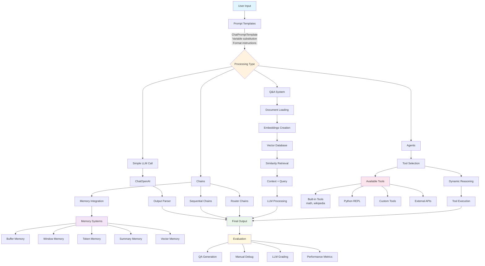

# LangChain for LLM Application Development - Study Summary

## Core LangChain Components Overview

### 1. Models and Prompts

**Models**
- **LLMs**: Basic language models for text generation
- **Chat Models**: Conversational models optimized for message exchanges
- **Text Embedding Models**: Convert text to vector representations

**Prompts and Templates**
- **ChatPromptTemplate**: Structured prompt creation with variables
- **Output Parsers**: Convert string outputs to structured data (dict/JSON)
- **ResponseSchema**: Define output structure for parsing
- **StructuredOutputParser**: Parse LLM outputs into defined schemas

**Key Objects**:
- `langchain.chat_models.ChatOpenAI`
- `langchain.prompts.ChatPromptTemplate`
- `langchain.output_parsers.StructuredOutputParser`

### 2. Memory Management

**Purpose**: LLMs are stateless; memory provides conversation context without exponential cost growth.

**Memory Types**:
- **ConversationBufferMemory**: Stores complete message history
- **ConversationBufferWindowMemory**: Limits to last `k` interactions
- **ConversationTokenBufferMemory**: Limits by token count
- **ConversationSummaryMemory**: Creates conversation summaries
- **Vector Memory**: Retrieves relevant past interactions
- **Entity Memory**: Tracks specific entity details

**Implementation**: Use `ConversationChain` instead of direct `ChatPromptTemplate` for memory functionality.

**Key Objects** (Deprecated for LangGraph):
- `langchain.chains.ConversationChain`
- `langchain.memory.ConversationBufferMemory`

### 3. Chains and Sequential Processing

**LLMChain**: Basic combination of prompt + model (deprecated, use `prompt | llm` syntax)

**Sequential Chains**:
- **SimpleSequentialChain**: Single input/output per step
- **SequentialChain**: Multiple inputs/outputs with explicit key mapping

**Router Chains**:
- **LLMRouterChain**: Routes queries to specialized chains based on content
- **MultiPromptChain**: Selects appropriate prompt template dynamically

**Key Features**:
- Precise input/output key alignment required
- Validation errors prevent execution if keys mismatch
- JSON-formatted routing decisions

**Key Objects**:
- `langchain.chains.LLMChain` (deprecated)
- `langchain.chains.SequentialChain`
- `langchain.chains.router.MultiPromptChain`

### 4. Question Answering Systems

**Core Process**:
1. Document loading from various sources (CSV, PDF, web)
2. Embedding creation and vector storage
3. Similarity-based document retrieval
4. LLM-powered answer generation with context

**Implementation Approaches**:

**Quick Setup**:
```python
index = VectorstoreIndexCreator(
    vectorstore_cls=DocArrayInMemorySearch
).from_loaders([loader])
response = index.query(query, llm=llm)
```

**Step-by-Step**:
1. Create embeddings with `OpenAIEmbeddings`
2. Build vector database with `DocArrayInMemorySearch`
3. Configure retriever
4. Use `RetrievalQA` chain

**Chain Types**:
- **Stuff**: Combine all documents in single prompt (fast, token-limited)
- **Map-Reduce**: Process documents separately, then combine
- **Refine**: Iteratively improve answers
- **Map-Rerank**: Score and select best documents

**Key Objects**:
- `langchain.chains.RetrievalQA`
- `langchain.indexes.VectorstoreIndexCreator`
- `langchain.vectorstores.DocArrayInMemorySearch`
- `langchain.embeddings.OpenAIEmbeddings`

### 5. Evaluation Framework

**Evaluation Methods**:

**Example Generation**:
- Manual test cases for specific scenarios
- LLM-generated examples using `QAGenerateChain`
- Combination of both for comprehensive coverage

**Manual Evaluation**:
- Debug mode (`langchain.debug = True`) for step-by-step analysis
- Direct response inspection
- Failure pattern identification

**LLM-Assisted Evaluation**:
- `QAEvalChain` for automated grading
- Performance metrics: correctness, completeness, relevance, consistency
- Scaled evaluation across large datasets

**Best Practices**:
- Comprehensive test coverage (factual, comparative, complex questions)
- Quality assurance for ground truth answers
- Continuous monitoring and iterative improvement

**Key Objects**:
- `langchain.evaluation.qa.QAGenerateChain`
- `langchain.evaluation.qa.QAEvalChain`

### 6. Agents and Tool Usage

**Agent Architecture**:
- **LLM**: Decision-making engine
- **Tools**: Executable functions (math, Wikipedia, Python, custom)
- **Agent Type**: Reasoning strategy (ReAct, Zero-shot)
- **Memory**: Optional conversation context

**Built-in Tools**:
- **llm-math**: Mathematical calculations
- **wikipedia**: Information retrieval
- **python_repl**: Code execution
- **Custom tools**: User-defined functions with `@tool` decorator

**Agent Types**:
- **CHAT_ZERO_SHOT_REACT_DESCRIPTION**: Zero-shot reasoning with ReAct framework (deprecated)
- Modern alternatives: LangGraph, `create_react_agent`

**Tool Creation Requirements**:
- Clear docstrings for LLM understanding
- Proper type hints
- Single-purpose functionality
- Robust error handling

**Key Objects**:
- `langchain.agents.load_tools`
- `langchain.agents.initialize_agent`
- `langchain.agents.tool`
- `langchain.tools.python.tool.PythonREPLTool`

## Development Best Practices

### Code Quality
- Follow existing codebase conventions
- Check for available libraries before assuming
- Implement proper error handling
- Avoid hardcoded secrets and keys

### Performance Optimization
- Monitor token usage and costs
- Choose appropriate chain types for document size
- Implement caching for frequent queries
- Consider chunking strategies for large documents

### Security and Reliability
- Validate inputs and outputs
- Implement fallback mechanisms
- Set appropriate timeouts
- Log decisions for debugging and improvement

### Modern Migration Paths
- **LangGraph**: Preferred for new agent applications
- **Tool-calling Models**: Native function calling
- **State Management**: Persistent conversation context
- **Observability**: Enhanced debugging capabilities

## Component Interaction Diagram



### Data Flow Patterns

**Linear Flow**: Input → Prompt → LLM → Output Parser → Result

**Sequential Flow**: Input → Chain₁ → Chain₂ → Chain₃ → Final Result

**Memory Flow**: Input + History → Process → Output + Updated History

**QA Flow**: Query → Embedding → Similarity Search → Context + Query → LLM → Answer

**Agent Flow**: Input → Tool Selection → Tool Execution → Result Synthesis → Output

**Evaluation Flow**: Examples → Predictions → Comparison → Metrics → Improvement

This comprehensive framework enables building sophisticated LLM applications with proper evaluation, memory management, and tool integration capabilities.