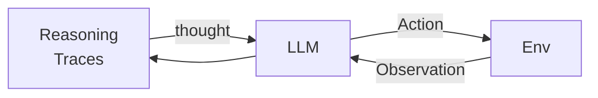
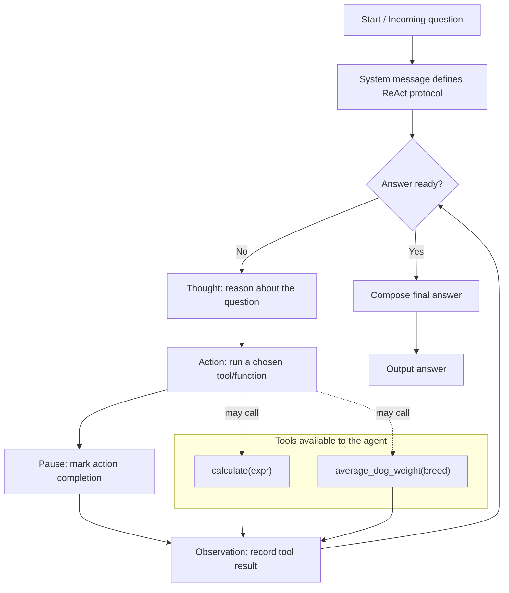
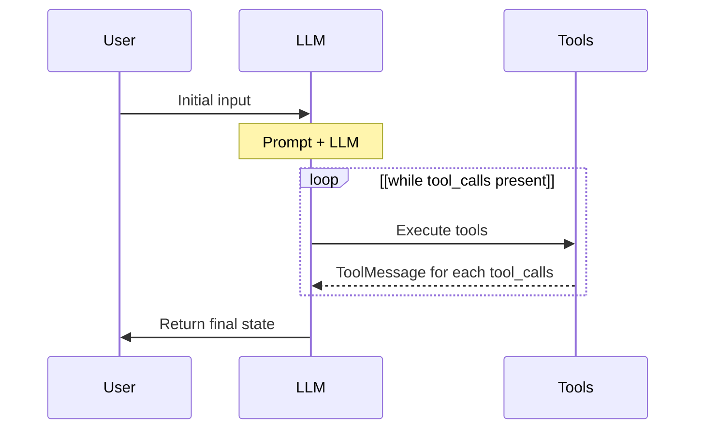
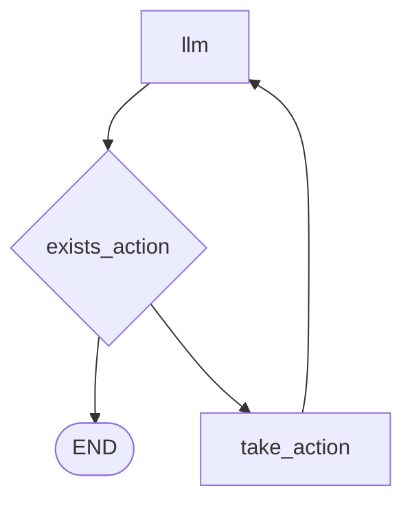
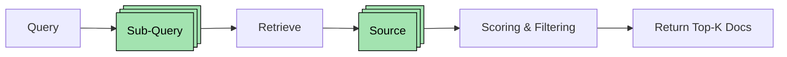
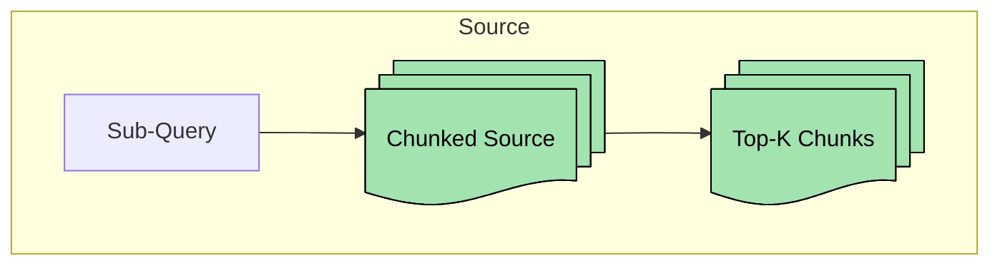

# ReAct Agent

> https://arxiv.org/abs/2210.03629

ReAct stands for reasoning and acting.

the **ReAct agent combines reasoning and acting**: it thinks about the problem, chooses actions using tools, observes the results, and then produces a final answer.



## ReAct Agent Workflow

1. **System Message Setup**
    - The agent requires a very specific system prompt to define how it should operate.
2. **Loop Execution**
    - The agent cycles through a structured loop of:
        - **Thought** → internal reasoning about the question.
        - **Action** → selecting and running an available tool/function.
        - **Pause** → marking the completion of the action.
        - **Observation** → capturing the result of the action.
3. **Answer Production**
    - Once the loop finishes, the agent outputs an answer.
4. **Tools Provided**
    - The agent is given access to specific tools/functions.
    - Example tools in the transcript:
        - `calculate` → evaluates string expressions.
        - `average_dog_weight` → returns mock weights for certain breeds.
5. **Traceability**
    - The workflow shows step-by-step traces:
      - Incoming question → Thought → Action → Pause → Observation → Answer.
6. **Example Run**
   * Input: *“How much does a toy poodle weigh?”*
   * Thought: *“I should look up the dog’s weight using average dog weight for a toy poodle.”*
   * Action: *`average_dog_weight, toy poodle`*
   * Observation: returns result.
   * Final Answer is then produced from the observation.



## Setup OpenAI


```python
# Setup OpenAI Tavily API key
def setup_openai_api_key():
    from dotenv import load_dotenv
    _ = load_dotenv()
setup_openai_api_key()

LLM_MODEL:str = "gpt-4o-mini"
# LLM_MODEL:str = "gpt-3.5-turbo"
```

**Agent class**


```python
import openai
from openai.types.chat.chat_completion import ChatCompletion
client = openai.OpenAI()

class Agent:
    def __init__(self, system:str=""):
        self.system = system
        self.messages:list[dict[str,str]] = []
        if self.system:
            self.messages.append({
                "role": "system",
                "content": system
            })
    def __call__(self, message:str):
        self.messages.append({
            "role": "user",
            "content": message
        })
        result = self.execute()
        self.messages.append({
            "role": "assistant",
            "content": result
        })
        return result

    def execute(self):
        completion:ChatCompletion = client.chat.completions.create(
            model=LLM_MODEL,
            temperature=0,
            messages=self.messages)
        return completion.choices[0].message.content
    
```

- `Agent.__call__`
  - add user message into agent's message array
  - add LLM response to agent's message array
- `OpenAI.chat.completions.create`
  - `temperature=0`: for the deterministic response
  - `messages=self.messages`: list of messages comprising the conversation so far.

**Agent prompt**


```python
prompt = """
You run in a loop of Thought, Action, PAUSE, Observation.
At the end of the loop you output an Answer
Use Thought to describe your thoughts about the question you have been asked.
Use Action to run one of the actions available to you - then return PAUSE.
Observation will be the result of running those actions.

Your available actions are:

calculate:
e.g. calculate: 4 * 7 / 3
Runs a calculation and returns the number - uses Python so be sure to use floating point syntax if necessary

average_dog_weight:
e.g. average_dog_weight: Collie
returns average weight of a dog when given the breed

Example session:

Question: How much does a Bulldog weigh?
Thought: I should look the dogs weight using average_dog_weight
Action: average_dog_weight: Bulldog
PAUSE

You will be called again with this:

Observation: A Bulldog weights 51 lbs

You then output:

Answer: A bulldog weights 51 lbs
""".strip()
```

**Agent actions**


```python
def calculate(what):
    return eval(what)

def average_dog_weight(name):
    if name in "Scottish Terrier": 
        return("Scottish Terriers average 20 lbs")
    elif name in "Border Collie":
        return("a Border Collies average weight is 37 lbs")
    elif name in "Toy Poodle":
        return("a toy poodles average weight is 7 lbs")
    else:
        return("An average dog weights 50 lbs")

known_actions = {
    "calculate": calculate,
    "average_dog_weight": average_dog_weight
}
```

**Manual Agent Example**


```python
agent = Agent(prompt)

agent_result = agent("How much does a toy poodle weigh?")
# link between thought and action is missing.
tool_result = average_dog_weight("Toy Poodle")
# link between tool result and agent input is missing.
agent_result = agent(f"Observation: {tool_result}")

for msg in agent.messages:
    print(msg)
```

**Agent with look example**


```python
import re
action_regex = re.compile("^Action: (\w+): (.*)$")

def query(question:str, max_iterations:int=5):
    agent = Agent(prompt)
    next_prompt:str = question
    for i in range(max_iterations):
        result = agent(next_prompt)
        print(result)
        actions = [
            action_regex.match(action)
            for action in result.split('\n')
            if action_regex.match(action)
        ]
        if len(actions) == 0:
            return
        
        action, action_input = actions[0].groups()
        if action not in known_actions:
            raise Exception(
                f"Unknown action: {action}: {action_input}")
        print(f" -- running {action} {action_input}")
        observation = known_actions[action](action_input)
        next_prompt = f"Observation: {observation}"
        print(next_prompt)

question = """\
I have 2 dogs, a border collie and a scottish terrier. \
What is their combined weight\
"""
query(question)
```

- `^Action: (\w+): (.*)$`
  - `^`
    - Start of string
  - `Action: `
    - Literal "Action: "
  - `(\w+)` 
    - Capture group 1
    - One or more word characters (letters, digits, underscore)
    - Action type
  - `: `
    - Literal ": "
  - `(.*)`
    - Capture group 2 - match().group(1)
    - Zero or more of any character (except newline)
    - Action input
  - `$`
    - End of string
- `action_regex.match`
  - `.group(0)` : The entire matched string
  - `.group(1)` : The action name (first capture group)
  - `.group(2)` : The action parameters (second capture group)
  - `.groups()` : `Tuple(.group(1), .group(2))`

# Agent in LangGraph

---
**Sequence Chart**

---
**Flow Chart**

---

### AgentState and Agent


```python
from langgraph.graph import StateGraph, END
from typing import TypedDict, Annotated
import operator
from langchain_core.messages import AnyMessage, SystemMessage, HumanMessage, ToolMessage
from langchain_community.tools.tavily_search import TavilySearchResults

tool = TavilySearchResults(max_results=4) #increased number of results
print(type(tool))
print(tool.name)

class AgentState(TypedDict):
    messages: Annotated[list[AnyMessage], operator.add]

class Agent:
    def __init__(self, model, tools, system:str=""):
        self.system:str = system
        graph:StateGraph = StateGraph(AgentState)
        graph.add_node("llm", self.call_openai)
        graph.add_node("action", self.take_action)
        graph.add_conditional_edges(
            "llm",
            self.exists_action,
            {True: "action", False: END}
        )
        graph.add_edge("action", "llm")
        graph.set_entry_point("llm")
        self.graph = graph.compile()
        self.tools = {t.name: t for t in tools}
        self.model = model.bind_tools(tools)

    def exists_action(self, state: AgentState):
        result = state["messages"][-1]
        return len(result.tool_calls) > 0
    
    def call_openai(self, state: AgentState):
        messages = state["messages"]
        if self.system:
            messages = [SystemMessage(content=self.system)] + messages
        message = self.model.invoke(messages)
        return {'messages': [message]}
    
    def take_action(self, state: AgentState):
        tool_calls = state["messages"][-1].tool_calls
        results: list[ToolMessage] = []
        for t in tool_calls:
            print(f"Calling: {t}")
            if not t["name"] in self.tools:
                print("...bad tool name...")
                result = "bad tool name, retry"
            else:
                result = self.tools[t["name"]].invoke(t["args"])
            results.append(ToolMessage(
                tool_call_id=t["id"],
                name=t["name"],
                content=str(result)))
        print("Back to the model")
        return {"messages": results}
```

- `AgentState`
  - accessible to all parts of the graph
  - local to the graph
  - can be stored in a persistence layer
    - can resume with the state at any point in time
  - `Annotated`
    - `list[AnyMessage]` is the actual type of `messages`
    - `operator.add` is used as message reducer. as a result, message will be concatenated rather than replaced on update
      - first callable metatdata
    - without `Annotated`, value will be replaced on update
- `StateGraph`
  - `add_node`: add node with name-runnable pair
  - `add_edge`: add connection between nodes in "from", "to" order
  - `add_conditional_edges`: `add_edge` but with condition
- each node returns `{"messages", result}`, which then gets added into `AgentState["messages"]`

#### State graph

> https://langchain-ai.github.io/langgraph/concepts/low_level/?h=stategraph#schema

The first thing to do when you defining a graph is define the `State` of the graph.

The `State` consists of:
- schema of the graph
- reducer functions which specify how to apply updates to the state

The schema of the State will be the input schema to all Nodes and Edges in the graph, and can be either a `TypedDict` or a `Pydantic` model. All Nodes will emit updates to the `State` which are then applied using the specified reducer function.


```python
from langchain_openai import ChatOpenAI
prompt = """You are a smart research assistant. Use the search engine to look up information. \
You are allowed to make multiple calls (either together or in sequence). \
Only look up information when you are sure of what you want. \
If you need to look up some information before asking a follow up question, you are allowed to do that!
"""

model = ChatOpenAI(model=LLM_MODEL)
abot = Agent(model, [tool], system=prompt)

# from IPython.display import Image
# Image(abot.graph.get_graph().draw_png())

messages = [HumanMessage(content="What is the weather in london?")]
result = abot.graph.invoke({"messages": messages})

print(result)
print(result['messages'][-1].content)
```

## Agentic search tool

Traditional zero-shot learning model struggles with dynamic data and sourcing information (live information). Agentic search addresses this by involving a search tool.

**The process involves:**
- Receiving a query and breaking it into sub-questions if needed.
- Selecting the best source (e.g. weather API for weather queries).
- Extracting and chunking relevant information.
- Running a vector search to retrieve top results.
- Scoring and filtering the output for relevance.

---
**Search flowchart**



---

**tavily search example**


```python
import os
from tavily import TavilyClient

client = TavilyClient(api_key=os.environ.get("TAVILY_API_KEY"))
result = client.search("What is in Nvidia's new Blackwell GPU?",
                       include_answer=True)
result["answer"]
```

## Persistence in LangGraph

> https://langchain-ai.github.io/langgraph/concepts/persistence/

LangGraph has a built-in persistence layer via **checkpointers**, which enable agents to save and restore state.

**Checkpointers** snapshot the state of the graph at each "super-step" during execution. **Checkpoints** capture:
- `config`: Config associated with this checkpoint.
- `metadata`: Metadata associated with this checkpoint.
- `values`: Values of the state channels at this point in time.
- `next`: A tuple of the node names to execute next in the graph.
- `tasks`: A tuple of `PregelTask` objects that contain information about next tasks to be executed.
  - If the step was previously attempted, it will include error information. 
  - If a graph was interrupted dynamically from within a node, tasks will contain additional data associated with interrupts.

Checkpoints are saved to a thread, which can be accessed after graph execution.
- Saved checkpoints belong to a **thread**, identified by `thread_id`. 
- Threads and checkpoints unlock powerful capabilities like:
    - **Human-in-the-loop** interactions
    - **Time travel** (past-state recovery)
    - **Fault-tolerance** (resuming after failure)
    - **Memory** across runs or conversations
- Checkpointers support various backends:
  - **In-memory** (for simple scenarios)
  - **SQLite** (via `SqliteSaver`)
  - Persistent stores like **Redis** and **PostgreSQL**, including those with vector similarity search

Core functionality of checkpoints are:
- Get state
  - `get_state`
  - get a state snapshot for a specific `checkpoint_id`
- Get state history
  - `get_state_history`
  - get the full history of the graph execution for a given thread
- Replay
  - `invoke`
  - re-play the previously executed steps before a checkpoint that corresponds to the `checkpoint_id`, and only execute the steps after the checkpoint
- Update state
  - `update_state`

**Available libraries:**
- `langgraph-checkpoint`
- `langgraph-checkpoint-sqlite`
- `langgraph-checkpoint-postgres`


## Streaming in LangGraph

> https://langchain-ai.github.io/langgraph/concepts/streaming/

LangGraph also offers a streaming system to provide real-time feedbacks.
`stream` replaces `invoke`.

**Categories:**
- **Workflow progress:** get state updates after each graph node is executed
- **LLM tokens:** stream language model tokens as they’re generated
- **Custom updates:** emit user-defined signals

**Supported stream modes**

Data can be streamed during graph excution using `stream` or `astream`

| Mode | Description |
| ---- | ----------- |
|values|Streams the full value of the state after each step of the graph.
|updates|Streams the updates to the state after each step of the graph. If multiple updates are made in the same step (e.g., multiple nodes are run), those updates are streamed separately.
|custom|Streams custom data from inside your graph nodes.
|messages|Streams 2-tuples (LLM token, metadata) from any graph nodes where an LLM is invoked.
debug|Streams as much information as possible throughout the execution of the graph.

## Overview of Persistence and Streaming

| Concept | Purpose | Benefits |
| ------- | ------- | -------- |
| **Persistence** | Saves and restores agent state across execution steps using checkpointers | Enables resilience, time travel, memory retention |
| **Streaming**   | Streams state changes, tokens, messages, and custom updates in real time  | Improves transparency, interactivity, and debugging capability |

**package**

```bash
uv add langgraph-checkpoint-sqlite
```


```python
from typing import TypedDict, Annotated
import operator

from langgraph.graph import StateGraph, END
from langchain_core.messages import AnyMessage, SystemMessage, HumanMessage, ToolMessage

class AgentState(TypedDict):
    messages: Annotated[list[AnyMessage], operator.add]

class Agent:
    def __init__(self, model, tools, checkpointer, system:str=""):
        self.system:str = system
        graph:StateGraph = StateGraph(AgentState)
        graph.add_node("llm", self.call_openai)
        graph.add_node("action", self.take_action)
        graph.add_conditional_edges(
            "llm",
            self.exists_action,
            {True: "action", False: END}
        )
        graph.add_edge("action", "llm")
        graph.set_entry_point("llm")
        self.graph = graph.compile(checkpointer=checkpointer)
        self.tools = {t.name: t for t in tools}
        self.model = model.bind_tools(tools)

    def exists_action(self, state: AgentState):
        result = state["messages"][-1]
        return len(result.tool_calls) > 0
    
    def call_openai(self, state: AgentState):
        messages = state["messages"]
        if self.system:
            messages = [SystemMessage(content=self.system)] + messages
        message = self.model.invoke(messages)
        return {'messages': [message]}
    
    def take_action(self, state: AgentState):
        tool_calls = state["messages"][-1].tool_calls
        results: list[ToolMessage] = []
        for t in tool_calls:
            print(f"Calling: {t}")
            if not t["name"] in self.tools:
                print("...bad tool name...")
                result = "bad tool name, retry"
            else:
                result = self.tools[t["name"]].invoke(t["args"])
            results.append(ToolMessage(
                tool_call_id=t["id"],
                name=t["name"],
                content=str(result)))
        print("Back to the model")
        return {"messages": results}
```


```python
from langchain_openai import ChatOpenAI
from langgraph.checkpoint.sqlite import SqliteSaver
from langchain_community.tools.tavily_search import TavilySearchResults

prompt = """You are a smart research assistant. Use the search engine to look up information. \
You are allowed to make multiple calls (either together or in sequence). \
Only look up information when you are sure of what you want. \
If you need to look up some information before asking a follow up question, you are allowed to do that!
"""

tool = TavilySearchResults(max_results=4)

with SqliteSaver.from_conn_string(":memory:") as checkpointer:
    model = ChatOpenAI(model=LLM_MODEL)
    agent = Agent(model, [tool], system=prompt, checkpointer=checkpointer)

    print("First iteration ============")
    messages = [HumanMessage(content="What is the weather in sf?")]
    thread = {"configurable": {"thread_id": "1"}}
    for event in agent.graph.stream({"messages": messages}, thread):
        for v in event.values():
            print(v['messages'])

    print("Second iteration ============")
    messages = [HumanMessage(content="What about in la?")]
    thread = {"configurable": {"thread_id": "1"}}
    for event in agent.graph.stream({"messages": messages}, thread):
        for v in event.values():
            print(v)
```


```python
from langchain_openai import ChatOpenAI
from langgraph.checkpoint.sqlite.aio import AsyncSqliteSaver
from langchain_community.tools.tavily_search import TavilySearchResults

prompt = """You are a smart research assistant. Use the search engine to look up information. \
You are allowed to make multiple calls (either together or in sequence). \
Only look up information when you are sure of what you want. \
If you need to look up some information before asking a follow up question, you are allowed to do that!
"""

async with AsyncSqliteSaver.from_conn_string(":memory:") as memory:
    tool = TavilySearchResults(max_results=4)
    model = ChatOpenAI(model=LLM_MODEL)
    agent = Agent(model, [tool], system=prompt, checkpointer=memory)

    messages = [HumanMessage(content="What is the weather in SF?")]
    thread = {"configurable": {"thread_id": "4"}}
    async for event in agent.graph.astream_events({"messages": messages}, thread, version="v1"):
        kind = event["event"]
        if kind == "on_chat_model_stream":
            content = event["data"]["chunk"].content
            if content:
                # Empty content in the context of OpenAI means
                # that the model is asking for a tool to be invoked.
                # So we only print non-empty content
                print(content, end="|")
```

- `AsyncSqliteSaver`
  - Package has been changed from `aiosqlite` to `sqlite.aio`

## Human in the Loop

> https://langchain-ai.github.io/langgraph/concepts/human_in_the_loop/#key-capabilities

In an agent workflow, with the **human-in-the-loop**, user can:
- review
- edit
- approve tool call

Additional state information is stored to memory and displayed when using `get_state` or `get_state_history`.
- `State` is additionally stored every state transition while previously it was stored at an interrupt or at the end.
- These change the command output slightly, but are a useful addtion to the information available.

**Key Capability**
- Persisent execution state
  - Interrupts use LangGraph's persistence layer, which saves the graph state
  - `interrupt` (dynamic) and `interrupt_before`/`interrupt_after` (static) can be used to pause a graph
- Flexible integration point
  - intturpt can be done at any point in a workflow


```python
from uuid import uuid4
from typing import TypedDict, Annotated
from langchain_core.messages import AnyMessage

"""
In previous examples we've annotated the `messages` state key
with the default `operator.add` or `+` reducer, which always
appends new messages to the end of the existing messages array.

Now, to support replacing existing messages, we annotate the
`messages` key with a customer reducer function, which replaces
messages with the same `id`, and appends them otherwise.
"""
def reduce_messages(left: list[AnyMessage], right: list[AnyMessage]) -> list[AnyMessage]:
    # assign ids to messages that don't have them
    for message in right:
        if not message.id:
            message.id = str(uuid4())
    # merge the new messages with the existing messages
    merged = left.copy()
    for message in right:
        for i, existing in enumerate(merged):
            # replace any existing messages with the same id
            if existing.id == message.id:
                merged[i] = message
                break
        else:
            # append any new messages to the end
            merged.append(message)
    return merged

class AgentState(TypedDict):
    messages: Annotated[list[AnyMessage], reduce_messages]
```

- `left`: existing snappshot state that human-in-the-loop is about to added in
- `right`: new message to merge into the `left`
  - if same id message exists, it'll replace the message with the same id
  - if same id message does not exist in `left`, it'll get appended


```python
from langgraph.graph import StateGraph, END
from langchain_core.messages import SystemMessage, ToolMessage

class Agent:
    def __init__(self, model, tools, system="", checkpointer=None):
        self.system = system
        graph = StateGraph(AgentState)
        graph.add_node("llm", self.call_openai)
        graph.add_node("action", self.take_action)
        graph.add_conditional_edges("llm", self.exists_action, {True: "action", False: END})
        graph.add_edge("action", "llm")
        graph.set_entry_point("llm")
        self.graph = graph.compile(
            checkpointer=checkpointer,
            interrupt_before=["action"]
        )
        self.tools = {t.name: t for t in tools}
        self.model = model.bind_tools(tools)

    def call_openai(self, state: AgentState):
        messages = state['messages']
        if self.system:
            messages = [SystemMessage(content=self.system)] + messages
        message = self.model.invoke(messages)
        return {'messages': [message]}

    def exists_action(self, state: AgentState):
        print(state)
        result = state['messages'][-1]
        return len(result.tool_calls) > 0

    def take_action(self, state: AgentState):
        tool_calls = state['messages'][-1].tool_calls
        results = []
        for t in tool_calls:
            print(f"Calling: {t}")
            result = self.tools[t['name']].invoke(t['args'])
            results.append(ToolMessage(tool_call_id=t['id'], name=t['name'], content=str(result)))
        print("Back to the model!")
        return {'messages': results}

```

- `__init__`
  - `interrupt_before` has been added when `graph.compile`


```python

from langchain_openai import ChatOpenAI
from langchain_core.messages import HumanMessage
from langchain_community.tools.tavily_search import TavilySearchResults
from langgraph.checkpoint.sqlite import SqliteSaver
from langgraph.types import StateSnapshot

tool = TavilySearchResults(max_results=2)

prompt = """You are a smart research assistant. Use the search engine to look up information. \
You are allowed to make multiple calls (either together or in sequence). \
Only look up information when you are sure of what you want. \
If you need to look up some information before asking a follow up question, you are allowed to do that!
"""

model = ChatOpenAI(model=LLM_MODEL)

with SqliteSaver.from_conn_string(":memory:") as memory:
    agent = Agent(model, [tool], system=prompt, checkpointer=memory)

    # 1. Normal stream
    if False:
        messages = [HumanMessage(content="Whats the weather in SF?")]
        thread = {"configurable": {"thread_id": "1"}}
        for event in agent.graph.stream({"messages": messages}, thread):
            for v in event.values():
                print(v)
        print("get state")
        print(agent.graph.get_state(thread))
        print(agent.graph.get_state(thread).next)

    # 2. Approve tool call
    if False:
        messages = [HumanMessage("Whats the weather in LA?")]
        thread = {"configurable": {"thread_id": "2"}}
        for event in agent.graph.stream({"messages": messages}, thread):
            for v in event.values():
                print(v)

        while agent.graph.get_state(thread).next:
            print("\n", agent.graph.get_state(thread),"\n")
            print("about to input")
            # This will cause hang in vscode jupyter notebook
            _input = input("proceed?")
            if _input != "y":
                print("aborting")
                break
            for event in agent.graph.stream(None, thread):
                for v in event.values():
                    print(v)
    
    # 3. Modify State
    if True:
        messages = [HumanMessage("Whats the weather in LA?")]
        thread = {"configurable": {"thread_id": "3"}}
        for event in agent.graph.stream({"messages": messages}, thread):
            for v in event.values():
                print(v)
        print("State before:", agent.graph.get_state(thread))
        current_values = agent.graph.get_state(thread)
        print(current_values.values['messages'][-1])
        print(current_values.values['messages'][-1].tool_calls)
        _id = current_values.values['messages'][-1].tool_calls[0]['id']
        current_values.values['messages'][-1].tool_calls = [{
            'name': 'tavily_search_results_json',
            'args': {'query': 'current weather in Louisiana'},
            'id': _id
        }]
        agent.graph.update_state(thread, current_values.values)
        print("State after:", agent.graph.get_state(thread))
        for event in agent.graph.stream(None, thread):
            for v in event.values():
                print(v)

    # Print all current states
    states: list[StateSnapshot] = []
    for state in agent.graph.get_state_history(thread):
        print(state)
        print('--')
        states.append(state)

    # 4. Time Travel
    if False:
        to_replay = states[-3]
        print("replay", to_replay)
        for event in agent.graph.stream(None, to_replay.config):
            for k, v in event.items():
                print(v)

    if False:
        to_replay = states[-3]
        print("replay", to_replay)
        _id = to_replay.values['messages'][-1].tool_calls[0]['id']
        to_replay.values['messages'][-1].tool_calls = [{
            'name': 'tavily_search_results_json',
            'args': {'query': 'current weather in LA, accuweather'},
            'id': _id
        }]
        branch_state = agent.graph.update_state(to_replay.config, to_replay.values)
        for event in agent.graph.stream(None, branch_state):
            for k, v in event.items():
                if k != "__end__":
                    print(v)

    # 5. Add message to a state at a given time
    to_replay = states[-3]
    print("replay", to_replay)
    _id = to_replay.values['messages'][-1].tool_calls[0]['id']
    state_update = {"messages": [ToolMessage(
        tool_call_id=_id,
        name="tavily_search_results_json",
        content="54 degree celcius",
    )]}
    branch_and_add = agent.graph.update_state(
        to_replay.config, 
        state_update, 
        as_node="action"
    )
    for event in agent.graph.stream(None, branch_and_add):
        for k, v in event.items():
            print(v)


```

- each returned state `StateSnapshot` contains full history until the snapshot point
- `get_state`
  - Get the current state of the graph
- `get_state_history`
  - Get the history of the state of the graph
  
**Small Graph Example**


```python
from langgraph.graph import StateGraph, END
from typing import TypedDict, Annotated
import operator
from langgraph.checkpoint.sqlite import SqliteSaver

class AgentState(TypedDict):
    lnode: str
    scratch: str
    count: Annotated[int, operator.add]

def node1(state: AgentState):
    print(f"node1, count:{state['count']}")
    return {
        "lnode": "node_1",
        "count": 1,
    }

def node2(state: AgentState):
    print(f"node2, count:{state['count']}")
    return {
        "lnode": "node_2",
        "count": 1,
    }

def should_continue(state):
    return state["count"] < 3

# Build graph
builder = StateGraph(AgentState)
builder.add_node("Node1", node1)
builder.add_node("Node2", node2)

builder.add_edge("Node1", "Node2")
builder.add_conditional_edges("Node2", 
                              should_continue, 
                              {True: "Node1", False: END})
builder.set_entry_point("Node1")

with SqliteSaver.from_conn_string(":memory:") as memory:
    graph = builder.compile(checkpointer=memory)

    # Run
    thread = {"configurable": {"thread_id": str(1)}}
    graph.invoke({"count":0, "scratch":"hi"},thread)

    # State
    print(graph.get_state(thread))

    # State history
    for state in graph.get_state_history(thread):
        print(state, "\n")

    # Config history
    states = []
    for state in graph.get_state_history(thread):
        states.append(state.config)
        print(state.config, state.values['count'])

    print(states[-3])
    print(graph.get_state(states[-3]))

    # Go back in time
    graph.invoke(None, states[-3])
    thread = {"configurable": {"thread_id": str(1)}}
    for state in graph.get_state_history(thread):
        print(state.config, state.values['count'])

    thread = {"configurable": {"thread_id": str(1)}}
    for state in graph.get_state_history(thread):
        print(state,"\n")

    # Modify state
    thread2 = {"configurable": {"thread_id": str(2)}}
    graph.invoke({"count":0, "scratch":"hi"},thread2)

    states2 = []
    for state in graph.get_state_history(thread2):
        states2.append(state.config)
        print(state.config, state.values['count'])   

    save_state = graph.get_state(states2[-3])
    print(save_state)

    save_state.values["count"] = -3
    save_state.values["scratch"] = "hello"
    print(save_state)

    graph.update_state(thread2,save_state.values)

    for i, state in enumerate(graph.get_state_history(thread2)):
        if i >= 3:  #print latest 3
            break
        print(state, '\n')

    # Modify state as node
    graph.update_state(thread2,save_state.values, as_node="Node1")
    for i, state in enumerate(graph.get_state_history(thread2)):
        if i >= 3:  #print latest 3
            break
        print(state, '\n')

    graph.invoke(None,thread2)
    for state in graph.get_state_history(thread2):
        print(state,"\n")

```

## Essay writer


```python
from langgraph.graph import StateGraph, END
from typing import TypedDict, Annotated, List
import operator
from langgraph.checkpoint.sqlite import SqliteSaver
from langchain_core.messages import AnyMessage, SystemMessage, HumanMessage, AIMessage, ChatMessage

class AgentState(TypedDict):
    task: str
    plan: str
    draft: str
    critique: str
    content: List[str]
    revision_number: int
    max_revisions: int

from langchain_openai import ChatOpenAI
model = ChatOpenAI(model=LLM_MODEL, temperature=0)

PLAN_PROMPT = """You are an expert writer tasked with writing a high level outline of an essay. \
Write such an outline for the user provided topic. Give an outline of the essay along with any relevant notes \
or instructions for the sections."""

WRITER_PROMPT = """You are an essay assistant tasked with writing excellent 5-paragraph essays.\
Generate the best essay possible for the user's request and the initial outline. \
If the user provides critique, respond with a revised version of your previous attempts. \
Utilize all the information below as needed: 

------

{content}"""

REFLECTION_PROMPT = """You are a teacher grading an essay submission. \
Generate critique and recommendations for the user's submission. \
Provide detailed recommendations, including requests for length, depth, style, etc."""

RESEARCH_PLAN_PROMPT = """You are a researcher charged with providing information that can \
be used when writing the following essay. Generate a list of search queries that will gather \
any relevant information. Only generate 3 queries max."""

RESEARCH_CRITIQUE_PROMPT = """You are a researcher charged with providing information that can \
be used when making any requested revisions (as outlined below). \
Generate a list of search queries that will gather any relevant information. Only generate 3 queries max."""

from pydantic import BaseModel

class Queries(BaseModel):
    queries: List[str]

from tavily import TavilyClient
import os
tavily = TavilyClient(api_key=os.environ["TAVILY_API_KEY"])

def plan_node(state: AgentState):
    messages = [
        SystemMessage(content=PLAN_PROMPT), 
        HumanMessage(content=state['task'])
    ]
    response = model.invoke(messages)
    return {"plan": response.content}

def research_plan_node(state: AgentState):
    print(state)
    queries = model.with_structured_output(Queries).invoke([
        SystemMessage(content=RESEARCH_PLAN_PROMPT),
        HumanMessage(content=state['task'])
    ])
    content = state['content'] or []
    for q in queries.queries:
        response = tavily.search(query=q, max_results=2)
        for r in response['results']:
            content.append(r['content'])
    return {"content": content}

def generation_node(state: AgentState):
    content = "\n\n".join(state['content'] or [])
    user_message = HumanMessage(
        content=f"{state['task']}\n\nHere is my plan:\n\n{state['plan']}")
    messages = [
        SystemMessage(
            content=WRITER_PROMPT.format(content=content)
        ),
        user_message
        ]
    response = model.invoke(messages)
    return {
        "draft": response.content, 
        "revision_number": state.get("revision_number", 1) + 1
    }

def reflection_node(state: AgentState):
    messages = [
        SystemMessage(content=REFLECTION_PROMPT), 
        HumanMessage(content=state['draft'])
    ]
    response = model.invoke(messages)
    return {"critique": response.content}

def research_critique_node(state: AgentState):
    queries = model.with_structured_output(Queries).invoke([
        SystemMessage(content=RESEARCH_CRITIQUE_PROMPT),
        HumanMessage(content=state['critique'])
    ])
    content = state['content'] or []
    for q in queries.queries:
        response = tavily.search(query=q, max_results=2)
        for r in response['results']:
            content.append(r['content'])
    return {"content": content}

def should_continue(state):
    if state["revision_number"] > state["max_revisions"]:
        return END
    return "reflect"

builder = StateGraph(AgentState)

builder.add_node("planner", plan_node)
builder.add_node("generate", generation_node)
builder.add_node("reflect", reflection_node)
builder.add_node("research_plan", research_plan_node)
builder.add_node("research_critique", research_critique_node)

builder.set_entry_point("planner")

builder.add_conditional_edges(
    "generate", 
    should_continue, 
    {END: END, "reflect": "reflect"}
)

builder.add_edge("planner", "research_plan")
builder.add_edge("research_plan", "generate")

builder.add_edge("reflect", "research_critique")
builder.add_edge("research_critique", "generate")


with SqliteSaver.from_conn_string(":memory:") as memory:
    graph = builder.compile(checkpointer=memory)
    # from IPython.display import Image
    # Image(graph.get_graph().draw_png())

    thread = {"configurable": {"thread_id": "1"}}
    for s in graph.stream({
        "task": "what is the difference between langchain and langsmith",
        "max_revisions": 2,
        "revision_number": 1,
    }, thread):
        print(s)

    ## Essay Writer Interface
    import warnings
    warnings.filterwarnings("ignore")
    from helper import ewriter, writer_gui

    MultiAgent = ewriter()
    app = writer_gui(MultiAgent.graph)
    app.launch()
```

### Run graph node in parallel

