# Baseline Email Assistant without Memory

**Table of contents**

- [Baseline Email Assistant without Memory](#baseline-email-assistant-without-memory)
  - [Learning objectives](#learning-objectives)
  - [LangChain objects](#langchain-objects)
  - [Memory](#memory)
    - [Memory types](#memory-types)
    - [Memory saving techniques](#memory-saving-techniques)
  - [Email assistant system architecture](#email-assistant-system-architecture)
    - [Overall pipeline](#overall-pipeline)
    - [Key components](#key-components)
  - [LangChain components](#langchain-components)
    - [Structured output with Pydantic](#structured-output-with-pydantic)
    - [Message format](#message-format)
  - [Component diagrams](#component-diagrams)
    - [1. Triage system](#1-triage-system)
    - [2. Memory components](#2-memory-components)
    - [3. Response agent system](#3-response-agent-system)
    - [4. LLM infrastructure](#4-llm-infrastructure)
    - [5. System overview](#5-system-overview)
- [Baseline email assistant example](#baseline-email-assistant-example)
  - [Setup router agent](#setup-router-agent)
  - [Define tools](#define-tools)
  - [Define main agent](#define-main-agent)
  - [Prompts](#prompts)
  - [How components relate to each other](#how-components-relate-to-each-other)
- [Others](#others)
  - [Few shot example](#few-shot-example)
  - [ReAct pattern](#react-pattern)
  - [Prompts examples](#prompts-examples)

## Learning objectives

- Architecture of a baseline email assistant system
- LangChain components for building agents
- Triage-based email classification system
- ReAct agents with tool integration
- Memory types: procedural, semantic, and episodic
- Memory update strategies: hot path and background processing
- Build structured LLM outputs with Pydantic validation

## LangChain objects

| Objects                                 | Description                               |
| --------------------------------------- | ----------------------------------------- |
| `langchain.chat_models.init_chat_model` | Factory function for creating chat models |
| `langchain.chat_models.BaseChatModel`   | Base class for chat model implementations |
| `langchain_core.tools.tool`             | Decorator for creating tools              |
| `langgraph.prebuilt.create_react_agent` | Creates ReAct pattern agents              |

## Memory

### Memory types

| Type           | Description          | Human Example              | LLM Implementation  | Email Assistant                               |
| -------------- | -------------------- | -------------------------- | ------------------- | --------------------------------------------- |
| **Semantic**   | Facts, knowledge     | Things learned from school | Facts about a user  | User preferences, contact info, VIP status    |
| **Episodic**   | Experiences, events  | Things I did yesterday     | Past agent actions  | Previous email interactions, meeting outcomes |
| **Procedural** | Instructions, skills | Motor skills, instincts    | Agent system prompt | Triage rules, response patterns, tool usage   |

### Memory saving techniques

#### Hot path memory updates

Update memory immediately during user interaction

**Pros**:
- **Simple Architecture**: One agent handles both response and memory updates
- **Immediate Consistency**: Memory is always up-to-date
**Cons**:
- **Higher Latency**: User waits for both response generation and memory updates
- **Complex Agent**: Single agent must handle multiple responsibilities

#### Background memory updates

**Concept**: Separate memory updates from user interaction

**Pros**:
- **Lower Latency**: User gets immediate response
-  **Specialized Agents**: Each agent has single responsibility
**Cons**:
- **Complex Architecture**: Two separate processes to maintain
- **Eventual Consistency**: Memory updates may lag behind interactions
#### Summary

| Aspect                      | Hot Path                     | Background            |
| --------------------------- | ---------------------------- | --------------------- |
| **Response Latency**        | Higher (memory + response)   | Lower (response only) |
| **Memory Consistency**      | Immediate                    | Eventual              |
| **Architecture Complexity** | Simple (1 agent)             | Complex (2 processes) |
| **Agent Responsibility**    | Multiple tasks               | Single task           |
| **Error Handling**          | Simpler                      | More complex          |
| **Scalability**             | Limited by memory operations | Better scalability    |

## Email assistant system architecture

### Overall pipeline

1. Email received in inbox
2. Triage
    - **Success**: urgent request, meeting request, etc.
    - **Fail**: spam, newslaetters, low priority updates, etc.
3. Input success email into LLM
4. Invoke appropriate tools
    - calendar tool: 
        - **Procedural memory** (system prompt)
            - meeting duration, buffer time
    - writing tool:  
        - **Procedural memory** (system prompt)
            - writing style
            - tone preference
            - response pattern
    - memory tool:
        - **Semantic Memory** profile
            - meeting preference, priority, VIP contacts
        - **Semantic Memory** collection
            - facts, past interactions

### Key components

**Router Agent**
- **Purpose**: Classify incoming emails into categories
- **Function**: Triage email into ignore/notify/respond
- **Output**: Structured Pydantic object with reasoning and classification

**Main Agent (Response Agent)**
- **Purpose**: Handle emails that require responses
- **Function**: Invoke tools or generate answers based on router decision
- **Model**: GPT-4o (more capable for complex reasoning and tool use)
- **Pattern**: ReAct (Reasoning + Acting)

## LangChain components

- **`@tool` decorator**
	-  Converts Python functions into LangChain tools
- **ReAct Agent**
	- **`create_react_agent`**: Creates agents using ReAct prompting pattern
	  - **ReAct Pattern**: 
		  - Reason (think) → Act (use tools) → Observe (see results) → Repeat
	  - **Parameters**:
	    - `model`: LLM to use for reasoning
	    - `tools`: List of available tools
	    - `prompt`: System prompt function
	  - **State**: Maintains conversation history in `messages` key

### Structured output with Pydantic

```python
class Router(BaseModel):
    reasoning: str = Field(description="Step-by-step reasoning")
    classification: Literal["ignore", "respond", "notify"] = Field(
        description="Email classification category"
    )
```

**Key Benefits**:
- **Validation**: Ensures output matches expected format
- **Type Safety**: Catches errors at runtime
- **Documentation**: Self-documenting schema

### Message format

LangChain chat models use standardised message format:
- **"system"**: Instructions/context for the model
- **"user"**: Human input
- **"assistant"**: Model responses

## Component diagrams

### 1. Triage system


### 2. Memory components


### 3. Response agent system


### 4. LLM infrastructure


### 5. System overview

```mermaid
flowchart TD
    A[📧 Incoming Email] --> B[📝 Input Processing]
    
    B --> C{🔍 Triage Router}
    C --> |ignore| D[🚫 End]
    C --> |notify| E[🔔 Notify Only]
    C --> |respond| F[🤖 Response Agent]
    
    F --> G{🛠️ Tool Selection}
    G --> H[✉️ Email Tool]
    G --> I[📅 Calendar Tool] 
    G --> J[🗓️ Meeting Tool]
    
    H --> K[📤 Final Response]
    I --> K
    J --> K
    
    subgraph "💾 Memory Systems"
        L[👤 Profile Memory]
        M[📋 Procedural Memory]
    end
    
    subgraph "🧠 LLM Models"
        N[GPT-4o-mini<br/>Triage]
        O[GPT-4o<br/>Response]
    end
    
    L -.-> C
    M -.-> C
    L -.-> F
    M -.-> F
    
    C -.-> N
    F -.-> O
    
    style A fill:#e1f5fe, color:#000
    style C fill:#fff3e0, color:#000
    style F fill:#f3e5f5, color:#000
    style K fill:#e8f5e8, color:#000
    style L fill:#fce4ec, color:#000
    style M fill:#fce4ec, color:#000
    style N fill:#e8eaf6, color:#000
    style O fill:#e8eaf6, color:#000
```




# Baseline email assistant example
## Setup router agent

**Setup memory**
```python
# Sementic memory (Facts about user)
profile = {
    "name": "John",
    "full_name": "John Doe",
    "user_profile_background": "Senior software engineer leading a team of 5 developers",
}
# Procedural memory (Instruction)
prompt_instructions = {
    "triage_rules": {
        "ignore": "Marketing newsletters, spam emails, mass company announcements",
        "notify": "Team member out sick, build system notifications, project status updates",
        "respond": "Direct questions from team members, meeting requests, critical bug reports",
    },
    "agent_instructions": "Use these tools when appropriate to help manage John's tasks efficiently."
}
```

**Setup agent**
```python
from pydantic import BaseModel, Field
from enum import StrEnum
from typing_extensions import TypedDict, Literal, Annotated
from langchain.chat_models import init_chat_model, BaseChatModel

# Setup Router
class Router(BaseModel):
    """Analyze the unread email and route it according to its content."""

    reasoning: str = Field(
        description="Step-by-step reasoning behind the classification."
    )
    classification: Literal["ignore", "respond", "notify"] = Field(
        description="The classification of an email: 'ignore' for irrelevant emails, "
        "'notify' for important information that doesn't need a response, "
        "'respond' for emails that need a reply",
    )

llm = init_chat_model("openai:gpt-4o-mini")
llm_router:BaseChatModel = llm.with_structured_output(Router)

# Setup Prompt
system_prompt = triage_system_prompt.format(
    full_name=profile["full_name"],
    name=profile["name"],
    examples=None,
    user_profile_background=profile["user_profile_background"],
    triage_no=prompt_instructions["triage_rules"]["ignore"],
    triage_notify=prompt_instructions["triage_rules"]["notify"],
    triage_email=prompt_instructions["triage_rules"]["respond"],
)
user_prompt = triage_user_prompt.format(
    author=email["from"],
    to=email["to"],
    subject=email["subject"],
    email_thread=email["body"],
)

# Run router
result = llm_router.invoke(
    [
        {"role": "system", "content": system_prompt},
        {"role": "user", "content": user_prompt},
    ]
)
print(result)
```

- Prompt is input when `llm_router.invoke`
- `with_structured_output`: See [with_structured_output](https://python.langchain.com/api_reference/community/chat_models/langchain_community.chat_models.openai.ChatOpenAI.html#langchain_community.chat_models.openai.ChatOpenAI.with_structured_output)
    - if input is a Pydantic class then the model output will be a Pydantic instance of that class, and the model-generated fields will be validated by the Pydantic class. Otherwise the model output will be a dict and will not be validated.
- How does `llm` know about `role`, `system`, and `user`?
    - You can determine if llm_router supports role, system, and user
  in several ways:
      1. Check the Base Model Type:
        - `print(llm.__class__.__name__)`
      2. LangChain Chat Models `BaseChatModel` Support Standard Roles:
        - "system" - Instructions/context
        - "user" - Human input
        - "assistant" - Model responses

## Define tools

```python
from langchain_core.tools import tool

@tool
def write_email(to: str, subject: str, content: str) -> str:
    """Write and send an email."""
    # Placeholder response - in real app would send email
    return f"Email sent to {to} with subject '{subject}'"

@tool
def schedule_meeting(
    attendees: list[str], 
    subject: str, 
    duration_minutes: int, 
    preferred_day: str
) -> str:
    """Schedule a calendar meeting."""
    # Placeholder response - in real app would check calendar and schedule
    return f"Meeting '{subject}' scheduled for {preferred_day} with {len(attendees)} attendees"

@tool
def check_calendar_availability(day: str) -> str:
    """Check calendar availability for a given day."""
    # Placeholder response - in real app would check actual calendar
    return f"Available times on {day}: 9:00 AM, 2:00 PM, 4:00 PM"
```

## Define main agent

```python
from prompts import agent_system_prompt
from langgraph.prebuilt import create_react_agent
def create_prompt(state):
    return [
        {
            "role": "system", 
            "content": agent_system_prompt.format(
                instructions=prompt_instructions["agent_instructions"],
                **profile
                )
        }
    ] + state['messages']

tools=[write_email, schedule_meeting, check_calendar_availability]
agent = create_react_agent(
    "openai:gpt-4o",
    tools=tools,
    prompt=create_prompt,
)
response = agent.invoke(
    {"messages": [{
        "role": "user", 
        "content": "what is my availability for tuesday?"
    }]}
)
response["messages"][-1].pretty_print()
```

- [create_react_agent](https://python.langchain.com/api_reference/langchain/agents/langchain.agents.react.agent.create_react_agent.html#create-react-agent): Create a agent using ReAct prompting

## Prompts

1. **System Prompt**
	* **Role section**: defines AI persona.
	* **Background section**: injects user profile.
	* **Instruction section**: how to classify into 3 categories.
	* **Rule section**: triage rules injected with `{variables}`.
2. **User Prompt**
	* Formats the raw email into structured input text for the model.

## How components relate to each other

| Component               | Description                                                         |
| ----------------------- | ------------------------------------------------------------------- |
| **User Profile**        | feeds into **system prompt** (background context)                   |
| **Prompt Instructions** | inserted into **system prompt** (rules + response strategy)         |
| **Email Schema**        | provides structured input for testing, formatted by **user prompt** |
| **Triage Agent**        | uses **system prompt + user prompt** + schema binding to classify   |
| **Structured Output**   | ensures triage step outputs valid category + reasoning              |

# Others

## Few shot example

Few-shot examples are **teaching samples** embedded directly in the system prompt.
For example:
- Right now: static
- Episodic memory: dynamically filled with actual past email handling episodes, making the assistant adaptive

## ReAct pattern

**ReAct = Reasoning + Acting**

The ReAct pattern enables LLMs to:
1. **Reason**: Think through the problem step-by-step
2. **Act**: Use available tools to gather information or take actions
3. **Observe**: Process the results from tool usage
4. **Repeat**: Continue the cycle until the task is complete

**Example ReAct Flow**:
```
User: "What is my availability for Tuesday?"

Thought: I need to check the user's calendar for Tuesday to see available time slots.
Action: check_calendar_availability
Action Input: {"day": "Tuesday"}
Observation: Available times on Tuesday: 9:00 AM, 2:00 PM, 4:00 PM

Thought: I now have the availability information. I can provide this to the user.
Final Answer: You have availability on Tuesday at 9:00 AM, 2:00 PM, and 4:00 PM.
```

**Key Advantages**:
- **Transparency**: Shows reasoning process
- **Tool Integration**: Seamlessly uses external tools
- **Error Recovery**: Can adjust approach based on observations
- **Flexibility**: Handles multi-step problems dynamically

## Prompts examples

**Agent prompt baseline**
```python
agent_system_prompt = """
< Role >
You are {full_name}'s executive assistant. You are a top-notch executive assistant who cares about {name} performing as well as possible.
</ Role >

< Tools >
You have access to the following tools to help manage {name}'s communications and schedule:

1. write_email(to, subject, content) - Send emails to specified recipients
2. schedule_meeting(attendees, subject, duration_minutes, preferred_day) - Schedule calendar meetings
3. check_calendar_availability(day) - Check available time slots for a given day
</ Tools >

< Instructions >
{instructions}
</ Instructions >
"""
```

**Agent prompt semantic memory**

```python
agent_system_prompt_memory = """
< Role >
You are {full_name}'s executive assistant. You are a top-notch executive assistant who cares about {name} performing as well as possible.
</ Role >

< Tools >
You have access to the following tools to help manage {name}'s communications and schedule:

1. write_email(to, subject, content) - Send emails to specified recipients
2. schedule_meeting(attendees, subject, duration_minutes, preferred_day) - Schedule calendar meetings
3. check_calendar_availability(day) - Check available time slots for a given day
4. manage_memory("email_assistant", user, "collection") - Store any relevant information about contacts, actions, discussion, etc. in memory for future reference
5. manage_memory("email_assistant", user, "user_profile") - Store any relevant information about the recipient, {name}, in the user profile for future reference the current user profile is shown below
6. search_memory("email_assistant", user, "collection") - Search memory for detail from previous emails
7. manage_memory("email_assistant", user, "instructions") - Update the instructions for agent tool usage based upon the user feedback 
</ Tools >

< User profile >
{profile}
</ User profile >

< Instructions >
{instructions}
</ Instructions >
"""
```

**Triage prompt**
```python
triage_system_prompt = """
< Role >
You are {full_name}'s executive assistant. You are a top-notch executive assistant who cares about {name} performing as well as possible.
</ Role >

< Background >
{user_profile_background}. 
</ Background >

< Instructions >

{name} gets lots of emails. Your job is to categorize each email into one of three categories:

1. IGNORE - Emails that are not worth responding to or tracking
2. NOTIFY - Important information that {name} should know about but doesn't require a response
3. RESPOND - Emails that need a direct response from {name}

Classify the below email into one of these categories.

</ Instructions >

< Rules >
Emails that are not worth responding to:
{triage_no}

There are also other things that {name} should know about, but don't require an email response. For these, you should notify {name} (using the `notify` response). Examples of this include:
{triage_notify}

Emails that are worth responding to:
{triage_email}
</ Rules >

< Few shot examples >
{examples}
</ Few shot examples >
"""

triage_user_prompt = """
Please determine how to handle the below email thread:

From: {author}
To: {to}
Subject: {subject}
{email_thread}"""

## Key takeaways for exam

### Core architecture concepts
1. **Two-Agent System**: Router (triage) + Response agent pattern
2. **Memory Types**: Procedural (instructions) vs Semantic (facts/profile)
3. **ReAct Pattern**: Reasoning → Acting → Observing cycle
4. **Structured Output**: Pydantic validation ensures reliable LLM responses

### Essential LangChain APIs
```python
# Chat Model Creation
llm = init_chat_model("openai:gpt-4o-mini")
structured_llm = llm.with_structured_output(PydanticClass)

# Tool Creation
@tool
def tool_function(param: str) -> str:
    """Tool description for LLM"""
    return result

# ReAct Agent
agent = create_react_agent(
    model="openai:gpt-4o",
    tools=[tool1, tool2],
    prompt=prompt_function
)
```
