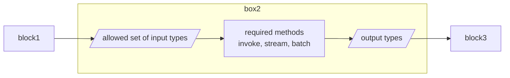
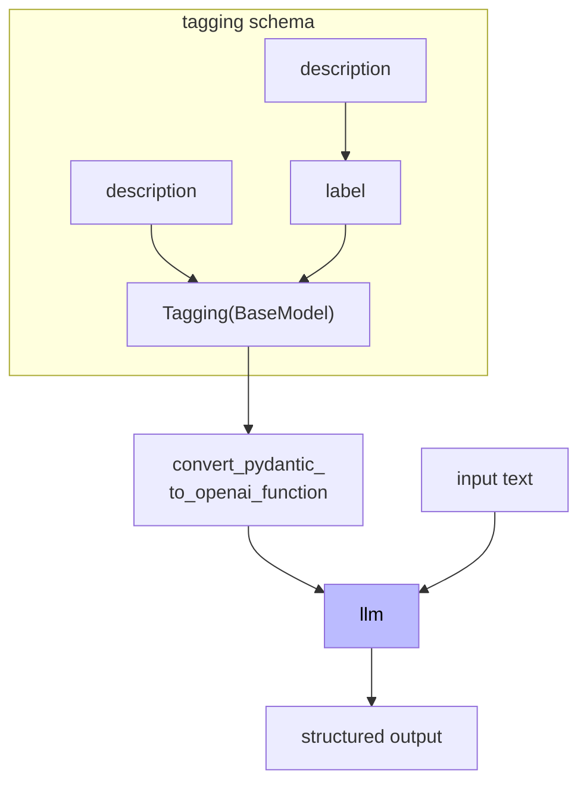

# OpenAI Function calling

**Table of Contents**

- [Overview](#overview)
- [LangChain Expression Language (LCEL)](#langchain-expression-language-lcel)
    - [Simple chain example](#simple-chain-example)
    - [Chain with embedding as context example](#chain-with-embedding-as-context-example)
    - [Chain with function bind](#chain-with-function-bind)
    - [Fallbacks](#fallbacks)
    - [Interface](#interface)
- [OpenAI Function Calling in LangChain](#openai-function-calling-in-langchain)
- [Tagging](#tagging)
- [Extraction](#extraction)
  - [Online document summarise example](#online-document-summarise-example)
- [Tools and Routing](#tools-and-routing)
- [Routing](#routing)
- [Direct interaction with OpenAPI](#direct-interaction-with-openapi)
- [Conversational Agent](#conversational-agent)
- [Custom Chatbot](#custom-chatbot)

# Overview

> https://platform.openai.com/docs/guides/function-calling

| Image | Description |
| ----- | ----------- |
 | With the function calling of OpenAI, the LLM will return:<br/><ul><li>which function to call</li><li>arguments of the function</li></ul>


**To leverage the function calling of OpenAI:**

1. define tools: [example](https://platform.openai.com/docs/guides/function-calling#defining-functions)
2. pass list of tools along with prompt into LLM
3. check `Response.output.type` is `"function_call"`
4. If it is, excute code on the application side with input from the tool call
5. Make a second request to the model with the tool output
6. Receive a final response from the model


```python
from openai import OpenAI
from openai.types.responses.function_tool_param import FunctionToolParam
import json

# mock of tool call of application
def get_current_weather(location: str, unit="celsius"):
    """Get the current weather in a given location"""
    weather_info = {
        "location": location,
        "temperature": "26",
        "unit": unit,
        "forecast": ["sunny", "windy"],
    }
    return json.dumps(weather_info)

# define a list of callable tools for the model
tools: list[FunctionToolParam]= [{
    "name": "get_current_weather",
    "description": "Get the current weather in a given location",
    "parameters": {
        "type": "object",
        "properties": {
            "location": {
                "type": "string",
                "description": "The city and country, e.g. London, UK",
            },
            "unit": {"type": "string", "enum": ["celsius", "fahrenheit"]},
        },
        "required": ["location"],
    },
    "strict": None,
    "type": "function"
}]

messages = [
    {
        "role": "user",
        "content": "What's the weather like in London?"
    }
]

# Prompt the model with tools defined
client = OpenAI()
response = client.responses.create(
    model=LLM_MODEL,
    tools=tools,
    input=messages,
)

# Save function call outputs for subsequent requests
messages += response.output

for item in response.output:
    if item.type == "function_call":
        if item.name == "get_current_weather":
            # 3. Execute the function logic for get_horoscope
            weather = get_current_weather(json.loads(item.arguments))
            
            # 4. Provide function call results to the model
            messages.append({
                "type": "function_call_output",
                "call_id": item.call_id,
                "output": json.dumps({
                  "weather": weather
                })
            })

print("Final input:")
print(messages)
response = client.responses.create(
    model=LLM_MODEL,
    tools=tools,
    input=messages,
)

print("Final output:")
print(response.model_dump_json(indent=2))
print("\n", response.output_text)
```

# LangChain Expression Language (LCEL)

LCEL and the runnable protocol defines "what" should happen, rather than "how". It's important that a "chain" is `Runnable`.



**Example of composition:**

```python
chain = prompt | llm | OutputParser
```

**Interface**

- Components implement `Runnable` protocol
- Common methods
  - `invoke` / `ainvoke`
  - `stream` / `astream`
  - `batch` / `abatch`
- Common properties
  - `input_schema`
  - `output_schema`
- Common I/O
    | Component     | Input Type                              | Output Type       |
    |---------------|-----------------------------------------|-------------------|
    | Prompt        | Dictionary                              | Prompt Value      |
    | Retriever     | Single String                           | List of Documents |
    | LLM           | String, list of messages or Prompt Value| String            |
    | ChatModel     | String, list of messages or Prompt Value| ChatMessage       |
    | Tool          | String/Dictionary                       | Tool dependent    |
    | Output Parser | Output of LLM or ChatModel              | Parser dependent  |

**Supported feature**

- async, batch and stream
- fallbacks
- parallelism
- logging

### Simple chain example


```python
from langchain.prompts import ChatPromptTemplate
from langchain_openai import ChatOpenAI
from langchain.schema.output_parser import StrOutputParser

prompt = ChatPromptTemplate.from_template(
    "tell me a short joke about {topic}"
)
model = ChatOpenAI()
output_parser = StrOutputParser()

chain = prompt | model | output_parser
chain.invoke({"topic": "bear"})
```

### Chain with embedding as context example

With `RunnableMap`, one input can be converted into the other format.


```python
from langchain.prompts import ChatPromptTemplate
from langchain_openai import ChatOpenAI
from langchain.embeddings import OpenAIEmbeddings
from langchain.vectorstores import DocArrayInMemorySearch
from langchain.schema.runnable import RunnableMap

vectorstore = DocArrayInMemorySearch.from_texts(
    [
        "harrison worked at kensho",
        "mears like to eat honey"
    ],
    embedding=OpenAIEmbeddings()
)
retriever = vectorstore.as_retriever()

print("get_relevant_documents")
print("- ", retriever.get_relevant_documents("where did harrison work?"))
print("- ", retriever.get_relevant_documents("what do bears like to eat?"))

template = """\
Answer the question based only on the following context:
{context}

Question: {question}
"""
prompt = ChatPromptTemplate.from_template(template)
model = ChatOpenAI()
chain= RunnableMap({
    "context": lambda x: retriever.get_relevant_documents(x["question"]),
    "question": lambda x: x["question"]
}) | prompt | model | output_parser

chain.invoke({"question": "where did harrison work?"})
```

### Chain with function bind

With function binding, LLM can extract relavant function name along with required arguments from the user message.


```python
from langchain.prompts import ChatPromptTemplate
from langchain_openai import ChatOpenAI

functions = [
    {
      "name": "weather_search",
      "description": "Search for weather given an airport code",
      "parameters": {
        "type": "object",
        "properties": {
          "airport_code": {
            "type": "string",
            "description": "The airport code to get the weather for"
          },
        },
        "required": ["airport_code"]
      }
    },
    {
      "name": "sports_search",
      "description": "Search for news of recent sport events",
      "parameters": {
        "type": "object",
        "properties": {
          "team_name": {
            "type": "string",
            "description": "The sports team to search for"
          },
        },
        "required": ["team_name"]
      }
    }
]

prompt = ChatPromptTemplate.from_messages([
    ("human", "{input}")
])
model = ChatOpenAI(temperature=0).bind(functions=functions)
chain = prompt | model

response = chain.invoke({"input": "what is the weather in London?"})
print(response)
response = chain.invoke({"input": "how did the patriots do yesterday?"})
print(response)


```

### Fallbacks

With fallbacks, we can handle LLM call failure


```python
from langchain.schema.output_parser import StrOutputParser
from langchain_openai import ChatOpenAI
from langchain.llms import OpenAI
import json

simple_model = OpenAI(
    temperature=0, 
    max_tokens=100, 
    model="gpt-3.5-turbo-instruct"
)
simple_chain = simple_model | json.loads


model = ChatOpenAI(temperature=0)
chain = model | StrOutputParser() | json.loads

final_chain = simple_chain.with_fallbacks([chain])

input = "write three poems in a json blob, where each poem is a json blob of a title, author, and first line"

try:
    simple_chain.invoke(input)
except Exception as e:
    print(f"Simple chain failed: {e}")

final_chain.invoke(input)
```

### Interface

As mentioned above, `invoke`, `stream`, and `batch` are supported interface along with their async implentation.
- `invoke`: normal run
- `stream`: async yeild
- `batch`: parallel


```python
prompt = ChatPromptTemplate.from_template(
    "Tell me a short joke about {topic}"
)
model = ChatOpenAI()
output_parser = StrOutputParser()
chain = prompt | model | output_parser

response = chain.invoke({"topic": "bears"})
print("invoke:", response)
response = chain.batch([{"topic": "bears"}, {"topic": "frogs"}])
print("batch:", response)
print("stream:")
for t in chain.stream({"topic": "bears"}):
    print(t)

response = await chain.ainvoke({"topic": "bears"})
print("ainvoke:", response)
```

# OpenAI Function Calling in LangChain

pydantic can be used to create a function definition. It's important to note that pydantic object itself is not used, but it's used to create a schema.

With function callings, LLM can:
1. invoke LLM with optional functions
2. bind functions to the LLM model to always refer to available functions
3. force LLM to return function


```python
from pydantic import BaseModel, Field
from langchain.utils.openai_functions import convert_pydantic_to_openai_function
from langchain.prompts import ChatPromptTemplate
from langchain_openai import ChatOpenAI

class WeatherSearch(BaseModel):
    """Call this with an airport code to get the weather at that airport"""
    airport_code: str = Field(description="airport code to get weather for")

weather_function = convert_pydantic_to_openai_function(WeatherSearch)
print(json.dumps(weather_function, indent=2))

model = ChatOpenAI()
# 1. invoke with functions directly
print("ivoke-functions:", model.invoke("what is the weather in SF today?", functions=[weather_function]))

# 2. bind functions to model first then invoke
model_with_function = model.bind(functions=[weather_function])
print("functions:", model_with_function.invoke("what is the weather in SF today?"))

# 3. force the model to use function
model_with_forced_function = model.bind(functions=[weather_function], function_call={"name":"WeatherSearch"})
print("function_call:", model_with_forced_function.invoke("hi!"))

# 4. with chain
prompt = ChatPromptTemplate.from_messages([
    ("system", "You are a helpful assistant"),
    ("user", "{input}")
])
chain = prompt | model_with_function
print("chain:", chain.invoke({"input": "what is the weather in sf?"}))

# 5. multiple functions
class ArtistSearch(BaseModel):
    """Call this to get the names of songs by a particular artist"""
    artist_name: str = Field(description="name of artist to look up")
    n: int = Field(description="number of results")
functions = [
    convert_pydantic_to_openai_function(WeatherSearch),
    convert_pydantic_to_openai_function(ArtistSearch),
]
model_with_functions = model.bind(functions=functions)
print("model_with_functions:", model_with_functions.invoke("what is the weather in sf?"))
print("model_with_functions:", model_with_functions.invoke("what are three songs by taylor swift?"))
print("model_with_functions:", model_with_functions.invoke("hi!"))
```

- `convert_pydantic_to_openai_function`
  - description of `BaseModel` is enforced (comment of pydantic class).
  - description of parametres are optional

# Tagging

LLM can evaluate the input text and generate structured output.
- LLM has been fine tuned to find and fill in the parameters when JSON schema is provided.

**Tagging means labeling a document with classes such as:**
- Sentiment
- Language
- Style (formal, informal etc.)
- Covered topics

**The core components of taggings are:**
- `function`: specify how the model tag an input
- `schema`: defines how to tag an input




```python
from enum import StrEnum
from pydantic import BaseModel, Field
from langchain.utils.openai_functions import convert_pydantic_to_openai_function
from langchain.prompts import ChatPromptTemplate
from langchain_openai import ChatOpenAI
from langchain.output_parsers.openai_functions import JsonOutputFunctionsParser

class Sentiment(StrEnum):
    positive = "positive"
    negative = "negative"
    neutral = "neutral"

class Tagging(BaseModel):
    """Tag the piece of text with particular info."""
    sentiment: Sentiment = Field(description="sentiment of text")
    language: str = Field(description="language of text (should be ISO 639-1 code)")

model = ChatOpenAI(temperature=0)
prompt = ChatPromptTemplate.from_messages([
    ("system", "Think carefully, and then tag the text as instructed"),
    ("user", "{input}")
])

tagging_functions = [convert_pydantic_to_openai_function(Tagging)]
print(tagging_functions)
model_with_functions = model.bind(
    functions=tagging_functions,
    function_call={"name": "Tagging"}
)
# Without parser
tagging_chain = prompt | model_with_functions
print(tagging_chain.invoke({"input": "I love langchain"}))
print(tagging_chain.invoke({"input": "non mi piace questo cibo"}))
# With parser
tagging_chain = prompt | model_with_functions | JsonOutputFunctionsParser()
print(tagging_chain.invoke({"input": "I love langchain"}))
print(tagging_chain.invoke({"input": "non mi piace questo cibo"}))
```

# Extraction

Similar to tagging, LLM can extract multiple pieces of information.


```python
from pydantic import BaseModel, Field
from langchain.utils.openai_functions import convert_pydantic_to_openai_function
from langchain_openai import ChatOpenAI

class Person(BaseModel):
    """Information about a person"""
    name: str = Field(description="person's name")
    age: int|None = Field(description="person's age")

class Information(BaseModel):
    """Information to extract."""
    people: list[Person] = Field(description="List of info about people")

extraction_functions = [convert_pydantic_to_openai_function(Information)]
print(extraction_functions)

model = ChatOpenAI(model=LLM_MODEL, temperature=0)
extraction_model = model.bind(functions=extraction_functions)
extraction_chain = extraction_model | JsonOutputFunctionsParser()
print(extraction_chain.invoke("Joe is 30, his mom is Martha"))

# with prompt to make sure to avoid filling incorrect information
prompt = ChatPromptTemplate.from_messages([
    ("system", "Extract the relevant information, if not explicitly provided do not guess. Extract partial info"),
    ("human", "{input}")
])
extraction_chain = prompt | extraction_model | JsonOutputFunctionsParser()
print(extraction_chain.invoke({"input": "Joe is 30, his mom is Martha"}))
```

## Online document summarise example

**Loading document**


```python
from langchain.document_loaders import WebBaseLoader
loader = WebBaseLoader("https://lilianweng.github.io/posts/2023-06-23-agent/")
documents = loader.load()
doc = documents[0]
page_content = doc.page_content[:10000]
print(page_content[:1000])
```

**Summarise**


```python
from pydantic import BaseModel
from langchain.output_parsers.openai_functions import JsonOutputFunctionsParser, JsonKeyOutputFunctionsParser
from langchain_openai import ChatOpenAI
from langchain.prompts import ChatPromptTemplate
from langchain.text_splitter import RecursiveCharacterTextSplitter
from langchain.schema.runnable import RunnableLambda

# setup model with prompt
prompt = ChatPromptTemplate.from_messages([
    ("system", "Extract the relevant information, if not explicitly provided do not guess. Extract partial info"),
    ("human", "{input}")
])
model = ChatOpenAI(model=LLM_MODEL, temperature=0)

# extraction schema
class Overview(BaseModel):
    """Overview of a section of text."""
    summary: str = Field(description="Provide a concise summary of the content.")
    language: str = Field(description="Provide the language that the content is written in.")
    keywords: str = Field(description="Provide keywords related to the content.")
overview_tagging_function = convert_pydantic_to_openai_function(Overview)
print(overview_tagging_function)

# chain everything to extract overview
tagging_model = model.bind(
    functions=[overview_tagging_function],
    function_call={"name":overview_tagging_function["name"]}
)
tagging_chain = prompt | tagging_model | JsonOutputFunctionsParser()
print(tagging_chain.invoke({"input": page_content}))

# chain to extract paper information
class Paper(BaseModel):
    """Information about papers mentioned."""
    title: str = Field(description="Title of a paper")
    author: str|None = Field(description="Author of a paper")

class Info(BaseModel):
    """Information to extract"""
    papers: list[Paper] = Field(description="List of information about paper")

paper_extraction_function = convert_pydantic_to_openai_function(Info)
extraction_model = model.bind(
    functions=[paper_extraction_function], 
    function_call={"name":paper_extraction_function["name"]}
)
extraction_chain = prompt | extraction_model | JsonKeyOutputFunctionsParser(key_name="papers")
print(extraction_chain.invoke({"input": page_content}))

# improved chain to extract paper information with prompt
template = """\
A article will be passed to you. Extract from it all papers that are mentioned by this article follow by its author. 

Do not extract the name of the article itself. If no papers are mentioned that's fine - you don't need to extract any! Just return an empty list.

Do not make up or guess ANY extra information. Only extract what exactly is in the text."""
prompt = ChatPromptTemplate.from_messages([
    ("system", template),
    ("human", "{input}")
])
extraction_chain = prompt | extraction_model | JsonKeyOutputFunctionsParser(key_name="papers")
print(extraction_chain.invoke({"input": page_content}))
print(extraction_chain.invoke({"input": "hi"}))

text_splitter = RecursiveCharacterTextSplitter(chunk_overlap=0)
splits = text_splitter.split_text(doc.page_content)

def flatten(matrix):
    """flatten list of list into a list"""
    flat_list = []
    for row in matrix:
        flat_list += row
    return flat_list

doc_splits = RunnableLambda(
    lambda x: [{"input": doc} for doc in text_splitter.split_text(x)]
)
chain = doc_splits | extraction_chain.map() | flatten
print(chain.invoke(doc.page_content))
```

- `Runnable.map`:
    - Return a new `Runnable` that maps a list of inputs to a list of outputs.
    - Calls invoke() with each input.

# Tools and Routing

> https://python.langchain.com/docs/integrations/tools/

Tools are utilities designed to be called by a model. Their inputs are designed to be generated by models, and their outputs are designed to be passed back to models. Functions and services in LLM can be represented as **tools** in LangChain. 

LangChain offers many tools such as:
- Search tools
- Math tools
- SQL tools

**basic tool definition example**


```python
import json
from langchain.agents import tool

@tool
def search(query: str) -> str:
    """Search for weather online"""
    return "42f"
print("name:", search.name)
print("desc:", search.description)
print("args:", json.dumps(search.args, indent=2))
```

- `search(query: str)`: argument of functions marked as tool
  - used as key of `dict` returned by `search.args`
  - used as `title` after first character is capitalised

**tool with pydantic schema example**


```python
import json
from langchain.agents import tool
from pydantic import BaseModel, Field

class SearchInput(BaseModel):
    query: str = Field(description="Thing to search for")

@tool(args_schema=SearchInput)
def search(query: str) -> str:
    """Search for the weather online."""
    return "42f"

print(search.run("sf"))
```

- In Pydantic's `Field`, the `...` (Ellipsis) means the field is required.
  - It's equivalent to specifying `default=None`
- `format_tool_to_openai_function` has been deprecated
  - `langchain_core.utils.function_calling.convert_to_openai_function`


```python
import requests
import datetime
import wikipedia
from pydantic import BaseModel, Field
from langchain_core.utils.function_calling import convert_to_openai_function

# Define the input schema
class OpenMeteoInput(BaseModel):
    latitude: float = Field(description="Latitude of the location to fetch weather data for")
    longitude: float = Field(description="Longitude of the location to fetch weather data for")

@tool(args_schema=OpenMeteoInput)
def get_current_temperature(latitude: float, longitude: float) -> dict:
    """Fetch current temperature for given coordinates."""
    
    BASE_URL = "https://api.open-meteo.com/v1/forecast"
    
    # Parameters for the request
    params = {
        'latitude': latitude,
        'longitude': longitude,
        'hourly': 'temperature_2m',
        'forecast_days': 1,
    }

    # Make the request
    response = requests.get(BASE_URL, params=params)
    
    if response.status_code == 200:
        results = response.json()
    else:
        raise Exception(f"API Request failed with status code: {response.status_code}")

    current_utc_time = datetime.datetime.now(datetime.timezone.utc)
    time_list = [datetime.datetime.fromisoformat(time_str).replace(tzinfo=datetime.timezone.utc) for time_str in results['hourly']['time']]
    temperature_list = results['hourly']['temperature_2m']
    
    closest_time_index = min(range(len(time_list)), key=lambda i: abs(time_list[i] - current_utc_time))
    current_temperature = temperature_list[closest_time_index]
    
    return f'The current temperature is {current_temperature}°C'

@tool
def search_wikipedia(query: str) -> str:
    """Run Wikipedia search and get page summaries."""
    page_titles = wikipedia.search(query)
    summaries = []
    for page_title in page_titles[: 3]:
        try:
            wiki_page =  wikipedia.page(title=page_title, auto_suggest=False)
            summaries.append(f"Page: {page_title}\nSummary: {wiki_page.summary}")
        except (
            wikipedia.exceptions.PageError,
            wikipedia.exceptions.DisambiguationError,
        ):
            pass
    if not summaries:
        return "No good Wikipedia Search Result was found"
    return "\n\n".join(summaries)

openai_fn = convert_to_openai_function(get_current_temperature)
print("name:", get_current_temperature.name)
print("desc:", get_current_temperature.description)
print("args:", get_current_temperature.args)
print("openai_fn:", openai_fn)

wikipedia_fn = convert_to_openai_function(search_wikipedia)
print("name:", search_wikipedia.name)
print("desc:", search_wikipedia.description)
print("args:", search_wikipedia.args)
print("wikipedia_fn:", wikipedia_fn)

print("temp:", get_current_temperature.invoke({"latitude": 13, "longitude": 14}))
print("wiki:", search_wikipedia.invoke({"query": "langchain"}))
```

# Routing

Selecting a tool from the output of LLM is **routing**.


```python
from langchain.prompts import ChatPromptTemplate
from langchain.schema.agent import AgentFinish
from langchain.agents.output_parsers import OpenAIFunctionsAgentOutputParser
functions =  [
    convert_to_openai_function(f) for f in [
        search_wikipedia,
        get_current_temperature
    ]
]
model = ChatOpenAI(temperature=0).bind(functions=functions)

print(model.invoke("what is the weather in sf right now"))
print(model.invoke("what is langchain"))

prompt = ChatPromptTemplate.from_messages([
    ("system", "You are helpful but sassy assistant"),
    ("user", "{input}"),
])
chain = prompt | model
chain.invoke({"input": "what is the weather in sf right now"})

chain_with_parser = prompt | model | OpenAIFunctionsAgentOutputParser()
result = chain_with_parser.invoke({"input": "what is the weather in sf right now"})
print("type :", type(result))
print("tool :", result.tool)
print("input:", result.tool_input)

result = chain_with_parser.invoke({"input": "hi!"})
print("type :", type(result))
print("ret  :", result.return_values)

# With router
def route(result):
    if isinstance(result, AgentFinish):
        return result.return_values['output']
    else:
        tools = {
            search_wikipedia.name : search_wikipedia,
            get_current_temperature.name : get_current_temperature,
        }
        return tools[result.tool].run(result.tool_input)

chain_with_router = prompt | model | OpenAIFunctionsAgentOutputParser() | route

print(chain_with_router.invoke({"input": "What is the weather in san francisco right now?"}))
print(chain_with_router.invoke({"input": "What is langchain?"}))
print(chain_with_router.invoke({"input": "hi!"}))
```

- `OpenAIFunctionsAgentOutputParser`
  - parse return message from OpenAI into `AgentActionMessageLog` or `AgentFinish`
  - `AgentActionMessageLog` can be routed to desired tool

# Direct interaction with OpenAPI


```python
text = """
{
  "openapi": "3.1.0",
  "jsonSchemaDialect": "https://spec.openapis.org/oas/3.1/dialect/base",
  "info": {
    "version": "1.0.0",
    "title": "Swagger Petstore",
    "license": {
      "name": "MIT"
    }
  },
  "servers": [
    {
      "url": "http://petstore.swagger.io/v1"
    }
  ],
  "paths": {
    "/pets": {
      "get": {
        "summary": "List all pets",
        "operationId": "listPets",
        "tags": [
          "pets"
        ],
        "parameters": [
          {
            "name": "limit",
            "in": "query",
            "description": "How many items to return at one time (max 100)",
            "required": false,
            "schema": {
              "type": "integer",
              "maximum": 100,
              "format": "int32"
            }
          }
        ],
        "responses": {
          "200": {
            "description": "A paged array of pets",
            "headers": {
              "x-next": {
                "description": "A link to the next page of responses",
                "schema": {
                  "type": "string"
                }
              }
            },
            "content": {
              "application/json": {
                "schema": {
                  "$ref": "#/components/schemas/Pets"
                }
              }
            }
          },
          "default": {
            "description": "Unexpected error",
            "content": {
              "application/json": {
                "schema": {
                  "$ref": "#/components/schemas/Error"
                }
              }
            }
          }
        }
      },
      "post": {
        "summary": "Create a pet",
        "operationId": "createPets",
        "tags": [
          "pets"
        ],
        "responses": {
          "201": {
            "description": "Created"
          },
          "default": {
            "description": "Unexpected error",
            "content": {
              "application/json": {
                "schema": {
                  "$ref": "#/components/schemas/Error"
                }
              }
            }
          }
        }
      }
    },
    "/pets/{petId}": {
      "get": {
        "summary": "Info for a specific pet",
        "operationId": "showPetById",
        "tags": [
          "pets"
        ],
        "parameters": [
          {
            "name": "petId",
            "in": "path",
            "required": true,
            "description": "The id of the pet to retrieve",
            "schema": {
              "type": "string"
            }
          }
        ],
        "responses": {
          "200": {
            "description": "Expected response to a valid request",
            "content": {
              "application/json": {
                "schema": {
                  "$ref": "#/components/schemas/Pet"
                }
              }
            }
          },
          "default": {
            "description": "Unexpected error",
            "content": {
              "application/json": {
                "schema": {
                  "$ref": "#/components/schemas/Error"
                }
              }
            }
          }
        }
      }
    }
  },
  "components": {
    "schemas": {
      "Pet": {
        "type": "object",
        "required": [
          "id",
          "name"
        ],
        "properties": {
          "id": {
            "type": "integer",
            "format": "int64"
          },
          "name": {
            "type": "string"
          },
          "tag": {
            "type": "string"
          }
        },
        "additionalProperties": false
      },
      "Pets": {
        "type": "array",
        "maxItems": 100,
        "items": {
          "$ref": "#/components/schemas/Pet"
        }
      },
      "Error": {
        "type": "object",
        "required": [
          "code",
          "message"
        ],
        "properties": {
          "code": {
            "type": "integer",
            "format": "int32"
          },
          "message": {
            "type": "string"
          }
        },
        "additionalProperties": false
      }
    }
  }
}
"""

from langchain.chains.openai_functions.openapi import openapi_spec_to_openai_fn
from langchain.utilities.openapi import OpenAPISpec
from langchain_openai import ChatOpenAI

spec = OpenAPISpec.from_text(text)
pet_openai_functions, pet_callables = openapi_spec_to_openai_fn(spec)
print("functions:", pet_openai_functions)
print("callables:", pet_callables)

model = ChatOpenAI(temperature=0).bind(functions=pet_openai_functions)
print(model.invoke("what are three pets names"))
print(model.invoke("tell me about pet with id 42"))
```

- OpenAPISpec has an issue, and following change needs to be made to make it work
    ```python
    # openapi.py
    @classmethod
    def parse_obj(cls, obj: dict) -> OpenAPISpec:
        try:
            cls._alert_unsupported_spec(obj)
            return super().model_validate(obj)
        except ValidationError as e:
            # We are handling possibly misconfigured specs and
            # want to do a best-effort job to get a reasonable interface out of it.
            new_obj = copy.deepcopy(obj)
            for error in e.errors():
                keys = error["loc"]
                item = new_obj
                for key in keys[:-1]:
                    item = item[key]
                item.pop(keys[-1], None)
            return cls.parse_obj(new_obj)
    ```


# Conversational Agent

Agent is a combination of LLMs and code. LLMs reason about what steps to tak and call for actions.
- Agent loop
  - Choose a tool to use
  - Observe the output of the tool
  - Repeat until a stopping condition is met
- Stopping condition can be
  - LLM determined
  - Hardcoded rules

**defining tools**


```python
import requests
import datetime
import wikipedia
from pydantic import BaseModel, Field
from langchain.tools import tool

# Define the input schema
class OpenMeteoInput(BaseModel):
    latitude: float = Field(description="Latitude of the location to fetch weather data for")
    longitude: float = Field(description="Longitude of the location to fetch weather data for")

@tool(args_schema=OpenMeteoInput)
def get_current_temperature(latitude: float, longitude: float) -> dict:
    """Fetch current temperature for given coordinates."""
    
    BASE_URL = "https://api.open-meteo.com/v1/forecast"
    params = {
        'latitude': latitude,
        'longitude': longitude,
        'hourly': 'temperature_2m',
        'forecast_days': 1,
    }
    # Make the request
    response = requests.get(BASE_URL, params=params)
    
    if response.status_code == 200:
        results = response.json()
    else:
        raise Exception(f"API Request failed with status code: {response.status_code}")

    current_utc_time = datetime.datetime.now(datetime.timezone.utc)
    time_list = [datetime.datetime.fromisoformat(time_str).replace(tzinfo=datetime.timezone.utc) for time_str in results['hourly']['time']]
    temperature_list = results['hourly']['temperature_2m']
    
    closest_time_index = min(range(len(time_list)), key=lambda i: abs(time_list[i] - current_utc_time))
    current_temperature = temperature_list[closest_time_index]
    
    return f'The current temperature is {current_temperature}°C'

@tool
def search_wikipedia(query: str) -> str:
    """Run Wikipedia search and get page summaries."""
    page_titles = wikipedia.search(query)
    summaries = []
    for page_title in page_titles[: 3]:
        try:
            wiki_page =  wikipedia.page(title=page_title, auto_suggest=False)
            summaries.append(f"Page: {page_title}\nSummary: {wiki_page.summary}")
        except (
            wikipedia.exceptions.PageError,
            wikipedia.exceptions.DisambiguationError,
        ):
            pass
    if not summaries:
        return "No good Wikipedia Search Result was found"
    return "\n\n".join(summaries)

tools = [get_current_temperature, search_wikipedia]
```

**chain of function and tool example**


```python
from langchain_openai import ChatOpenAI
from langchain.prompts import ChatPromptTemplate
from langchain.tools.render import format_tool_to_openai_function
from langchain.prompts import MessagesPlaceholder
from langchain.agents.output_parsers import OpenAIFunctionsAgentOutputParser
from langchain.agents.format_scratchpad import format_to_openai_functions
from langchain_core.agents import AgentAction, AgentActionMessageLog

functions = [format_tool_to_openai_function(f) for f in tools]
model = ChatOpenAI(temperature=0).bind(functions=functions)
# chain basic
prompt = ChatPromptTemplate.from_messages([
    ("system", "You are helpful but sassy assistant"),
    ("user", "{input}"),
])
chain = prompt | model | OpenAIFunctionsAgentOutputParser()
result = chain.invoke({"input": "what is the weather is sf?"})
print("result:", result)
if  isinstance(result, AgentActionMessageLog):
    print("tool  :", result.tool)
    print("toolin:", result.tool_input)

# chain1
prompt = ChatPromptTemplate.from_messages([
    ("system", "You are helpful but sassy assistant"),
    ("user", "{input}"),
    MessagesPlaceholder(variable_name="agent_scratchpad")
])
chain = prompt | model | OpenAIFunctionsAgentOutputParser()
result1 = chain.invoke({
    "input": "what is the weather is sf?",
    "agent_scratchpad": []
})

print("result1:", result1)
print("type.  :", type(result1))
if  isinstance(result1, AgentActionMessageLog):
    print("tool   :", result1.tool)
    print("msg log:", result1.message_log)

    observation = get_current_temperature.invoke(result1.tool_input)
    openai_fn_format = format_to_openai_functions([(result1, observation), ])
    result2 = chain.invoke({
        "input": "what is the weather is sf?", 
        "agent_scratchpad": openai_fn_format,
    })
    print("observ :", observation)
    print("openfn :", openai_fn_format)
    print("result2:", result2)
```

**agent chain example**


```python
from langchain.schema.agent import AgentFinish
from langchain.schema.runnable import RunnablePassthrough
from langchain.agents import AgentExecutor

prompt = ChatPromptTemplate.from_messages([
    ("system", "You are helpful but sassy assistant"),
    ("user", "{input}"),
    MessagesPlaceholder(variable_name="agent_scratchpad")
])

agent_chain = RunnablePassthrough.assign(
    agent_scratchpad= lambda x: format_to_openai_functions(x["intermediate_steps"])
) | prompt | model | OpenAIFunctionsAgentOutputParser()

def run_agent(user_input):
    intermediate_steps = []
    while True:
        result = agent_chain.invoke({
            "input": user_input,                     # initial user input
            "intermediate_steps": intermediate_steps # keep growing with observation
        })
        if isinstance(result, AgentFinish):
            return result
        tool = {
            "search_wikipedia": search_wikipedia, 
            "get_current_temperature": get_current_temperature,
        }[result.tool]
        observation = tool.run(result.tool_input)
        intermediate_steps.append((result, observation))

print(run_agent("what is the weather is sf?"))
print(run_agent("what is langchain?"))
print(run_agent("hi!"))

# with wrapper AgentExecutor
agent_executor = AgentExecutor(agent=agent_chain, tools=tools, verbose=True)
agent_executor.invoke({"input": "what is langchain?"})
agent_executor.invoke({"input": "my name is bob"})
agent_executor.invoke({"input": "what is my name"})
```

- `RunnablePassthrough`
    - Runnable to passthrough inputs unchanged or with additional keys.
    - `assign`: unchainged input with additional key-val pair from assigned by `assign`
    ```python
    runnable = {
      'llm1':  lambda: "llm1_fin",
      'llm2':  lambda: "llm2_fin",
      } | RunnablePassthrough.assign(
          total_chars=lambda inputs: len(inputs['llm1'] + inputs['llm2'])
      )
      runnable.invoke('hello')
      # {'llm1': 'llm1_fin', 'llm2': 'llm2_fin', 'total_chars': 16}
    ```
- `format_to_openai_functions`
  - Convert `(AgentAction, tool output)` tuples into `FunctionMessages`.
  - when input is empty list `[]`, return `[]`


```python
from langchain.schema.runnable import RunnablePassthrough
from langchain.agents.output_parsers import OpenAIFunctionsAgentOutputParser
from langchain.agents import AgentExecutor
from langchain.prompts import MessagesPlaceholder
from langchain.prompts import ChatPromptTemplate

# With memory
prompt = ChatPromptTemplate.from_messages([
    ("system", "You are helpful but sassy assistant"),
    MessagesPlaceholder(variable_name="chat_history"),
    ("user", "{input}"),
    MessagesPlaceholder(variable_name="agent_scratchpad")
])
agent_chain = RunnablePassthrough.assign(
    agent_scratchpad= lambda x: format_to_openai_functions(x["intermediate_steps"])
) | prompt | model | OpenAIFunctionsAgentOutputParser()
from langchain.memory import ConversationBufferMemory
memory = ConversationBufferMemory(return_messages=True,memory_key="chat_history")
agent_executor = AgentExecutor(agent=agent_chain, tools=tools, verbose=True, memory=memory)

agent_executor.invoke({"input": "my name is bob"})
agent_executor.invoke({"input": "whats my name"})
agent_executor.invoke({"input": "whats the weather in sf?"})
```

# Custom Chatbot


```python
@tool
def create_your_own(query: str) -> str:
    """This function can do whatever you would like once you fill it in """
    print(type(query))
    return query[::-1]

tools = [get_current_temperature, search_wikipedia, create_your_own]

import panel as pn  # GUI
pn.extension()
import panel as pn
import param

class cbfs(param.Parameterized):
    
    def __init__(self, tools, **params):
        super(cbfs, self).__init__( **params)
        self.panels = []
        self.functions = [format_tool_to_openai_function(f) for f in tools]
        self.model = ChatOpenAI(temperature=0).bind(functions=self.functions)
        self.memory = ConversationBufferMemory(return_messages=True,memory_key="chat_history")
        self.prompt = ChatPromptTemplate.from_messages([
            ("system", "You are helpful but sassy assistant"),
            MessagesPlaceholder(variable_name="chat_history"),
            ("user", "{input}"),
            MessagesPlaceholder(variable_name="agent_scratchpad")
        ])
        self.chain = RunnablePassthrough.assign(
            agent_scratchpad = lambda x: format_to_openai_functions(x["intermediate_steps"])
        ) | self.prompt | self.model | OpenAIFunctionsAgentOutputParser()
        self.qa = AgentExecutor(agent=self.chain, tools=tools, verbose=False, memory=self.memory)
    
    def convchain(self, query):
        if not query:
            return
        inp.value = ''
        result = self.qa.invoke({"input": query})
        self.answer = result['output'] 
        self.panels.extend([
            pn.Row('User:', pn.pane.Markdown(query, width=450)),
            pn.Row('ChatBot:', pn.pane.Markdown(self.answer, width=450, styles={'background-color': '#F6F6F6'}))
        ])
        return pn.WidgetBox(*self.panels, scroll=True)


    def clr_history(self,count=0):
        self.chat_history = []
        return

# Chatbot
cb = cbfs(tools)

inp = pn.widgets.TextInput( placeholder='Enter text here…')

conversation = pn.bind(cb.convchain, inp) 

tab1 = pn.Column(
    pn.Row(inp),
    pn.layout.Divider(),
    pn.panel(conversation,  loading_indicator=True, height=400),
    pn.layout.Divider(),
)

dashboard = pn.Column(
    pn.Row(pn.pane.Markdown('# QnA_Bot')),
    pn.Tabs(('Conversation', tab1))
)
dashboard
```


```python

```
